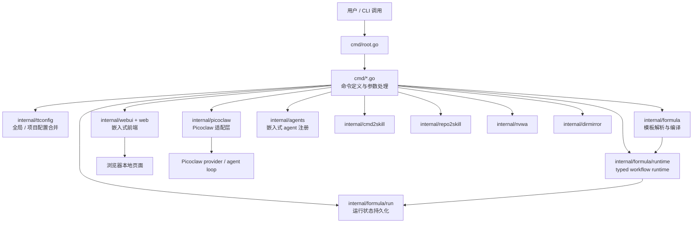
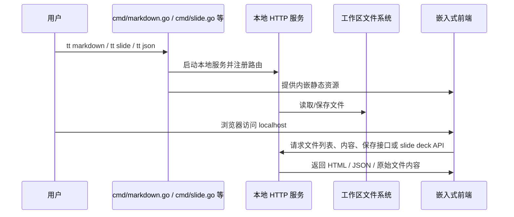
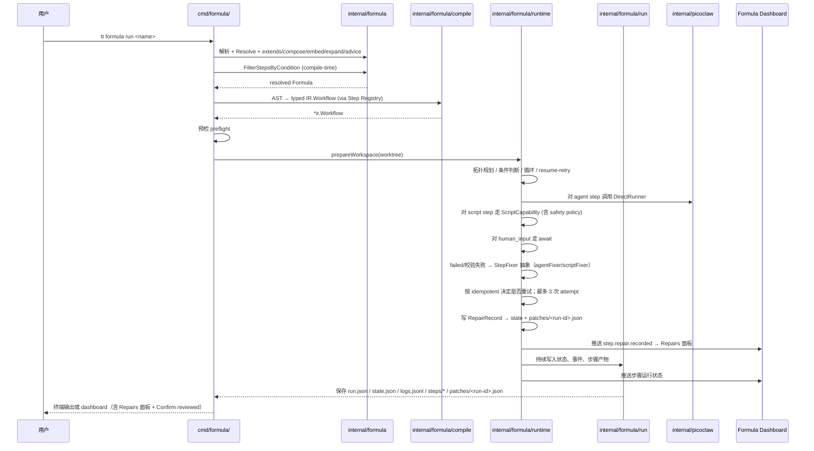
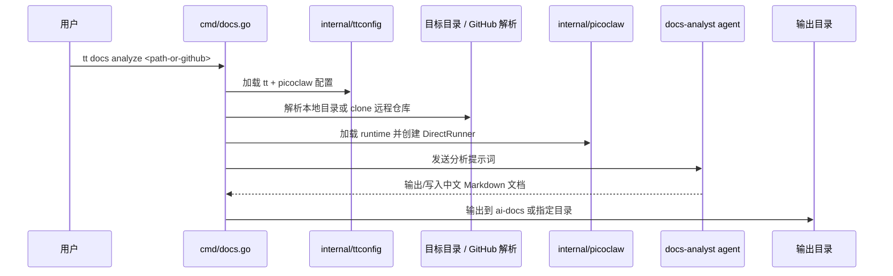
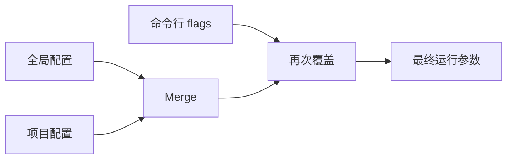
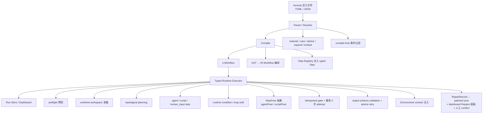

# 架构与运行模型

> 最后更新：2026-06-05

## 总体结论

`tt` 的架构可以概括为三层：

1. **命令编排层**：`cmd/`，负责 Cobra 命令、flag、输入归一化、输出组织。
2. **领域能力层**：`internal/` 下的各主题包，负责真正的业务逻辑。
3. **运行时与呈现层**：Picoclaw runtime、本地 HTTP/Web UI、formula run store 与 dashboard，为上层命令提供执行环境或用户界面。

## 总体架构图



这张图表达的是：`tt` 不是单核系统，而是一组共享基础设施的命令簇。

## 四类核心运行路径

### 1. 本地 Web UI 路径
例如 `markdown`、`slide`、`json`、`conversation`、`skill`。



这类命令的特点是：**Go 负责后端文件 API 和安全边界，前端负责交互体验**。其中 `tt slide` 专门处理 `.slide` deck，前端用 Reveal.js 渲染，MagiCloud 模板支持 `.end` / `.closing` / `.final` 尾页封底。

### 2. Picoclaw 运行时路径
例如 `agent`、`translate`、`debate`、`nvwa`、`repo2skill` 的 agent 模式。

```mermaid
sequenceDiagram
    participant User as 用户
    participant Cmd as cmd/agent.go 等
    participant TT as internal/ttconfig
    participant PC as internal/picoclaw
    participant AG as internal/agents
    participant Loop as Picoclaw AgentLoop

    User->>Cmd: 执行带模型/agent 的命令
    Cmd->>TT: 加载并合并 tt 配置
    Cmd->>PC: Load runtime
    PC->>PC: 解析 home/config 路径
    PC->>Loop: 创建 provider 与 agent loop
    Cmd->>AG: 提供 embedded agents
    Cmd->>PC: NewDirectRunner / Run
    PC->>Loop: ProcessDirect / ProcessDirectForAgent
    Loop-->>Cmd: 返回文本响应
    Cmd-->>User: 渲染输出
```

这里最关键的是：`tt` 不是自己重写一套 agent runtime，而是把 Picoclaw 作为底层引擎，通过内部包装层统一接入。

### 3. Formula 工作流路径
例如 `tt formula run`。



这个链路体现了项目里最复杂的协作关系：formula 提供"声明式定义"，typed runtime 提供"执行语义"，Picoclaw 提供"智能步骤执行能力"，formula/run 提供"可恢复的运行痕迹"。

### 4. docs 分析路径
例如 `tt docs analyze`。



这条路径说明：`tt` 已经不只是消费 agent，还开始把 agent 当成"代码理解工作流"的一部分。

## 配置分层模型

`internal/ttconfig` 采用双层配置：

- 全局配置：`~/.tt/config.json` 或 `TT_CONFIG`
- 项目配置：最近的 `.tt/config.json` 或 `TT_PROJECT_CONFIG`

项目配置覆盖全局配置。它主要影响：

- Picoclaw home / config 路径
- agent 默认 session / model / debug
- debate 参数
- markdown / conversation 默认端口与 pattern
- mirror 路径



这张图解释了为什么许多命令都有"先读配置，再看 flags 是否显式覆盖"的结构。

## Formula 的内部子分层

如果只看 `formula` 功能，内部又可以拆成多层：



这张图最值得注意的是：**formula 不是边解析边执行，而是先解析成 Formula，再编译成 typed `ir.Workflow`（含 `steps.Step` 接口实例），再交给 typed runtime 运行**。这让编译和执行两个阶段职责更清晰，也更利于 resume、可视化和落盘。

## 代码组织上的重要边界

### `cmd/` 与 `internal/` 的边界
- `cmd/` 更像"适配层"，负责输入、帮助文案、输出和组装。
- `internal/` 才是复用点和复杂逻辑中心。

### `internal/formula` 与 typed runtime 的边界
- `internal/formula/spec`：**叶子数据契约子包**——Formula / Step / VarDef / PreflightSpec / BondPoint / Hook / WaitsForSpec / Type 等所有数据结构的唯一来源，供 doc / ui / run / runview / cmd 共用。
- `internal/formula`：定义语言、解析、继承、扩展、把 Formula 编译成 typed `ir.Workflow`（仍在 `formula` 包中），所有数据契约都引用 `spec` 子包。
- `internal/formula/ast` / `ir` / `compile`：AST、IR 和另一条 AST→IR 编译路径，与 Step Registry 配合。
- `internal/formula/runtime`：执行 typed Workflow，处理拓扑规划、状态、resume/retry、事件、environment、worktree、validation、repair。
- `internal/formula/steps`：承载 agent / script / human_input / noop / loop / retry / aggregate / tool / write_files 等 Step 接口实现，由 `Registry` 管理。
- `internal/formula/builtin`：内置 formulas 与 atomics，作为新 formula 的起点。
- `internal/formula/doc` / `ui` / `run` / `runview`：分别承担 markdown 渲染、dashboard DTO + graph、运行记录持久化、运行时 snapshot → dashboard snapshot 投影；这四个子包原本是 `internal/formuladoc|formulaui|formularun|formularunview` 平级包，2026-06 重构后归并为 `formula` 的子包，彻底打破与父包的导入环。

### `internal/picoclaw` 与 `internal/agents` 的边界
- `picoclaw`：运行时加载、provider 创建、direct runner 包装。
- `agents`：嵌入式 agent 定义的发现、解析与注册。

### `internal/formula/run` 的独立价值
它不是执行器的附属小工具，而是一个专门负责"运行状态持久化"的层，负责：

- 运行元数据 `run.json`
- 编译结果 `workflow.json`
- 运行快照 `state.json`
- 事件流 `logs.jsonl`
- 步骤级 prompt / output / error 产物
- final report chat 历史（嵌入 snapshot，由 dashboard 渲染）
- stale run 检测
- 与 `internal/formula/runview` 配合，把 `runtime.Snapshot` 转成 dashboard `formula/ui.Snapshot`

## 为什么说这是"平台型 CLI"

因为它的很多功能不是一次性脚本，而是可持续扩展的能力挂载点：

- 新命令可以继续挂在 `cmd/`
- 新 agent 可以继续放进 `internal/agents/embedded`
- 新 workflow 可以落在 `.tt/formulas/`
- 新前端 UI 可以继续走 `web -> embed -> internal/webui` 路线
- 新的代码理解自动化能力可以沿 `docs analyze` 的模式继续扩展

换言之，`tt` 当前已经具备一种"小型本地自动化平台"的雏形。

## 实现参考

- 根命令：`cmd/root.go`
- 配置合并：`internal/ttconfig/config.go`
- Picoclaw runtime：`internal/picoclaw/runtime.go`、`internal/picoclaw/direct.go`
- formula 解析与编译：`internal/formula/parser.go`、`internal/formula/workflow.go`、`internal/formula/compile/compiler.go`
- Typed runtime：`internal/formula/runtime/executor.go`、`internal/formula/runtime/environment.go`、`internal/formula/runtime/workspace.go`、`internal/formula/runtime/capabilities.go`、`internal/formula/steps/`
- Step 注册表：`internal/formula/steps/registry.go`、`internal/formula/steps/kinds.go`
- 运行持久化：`internal/formula/run/store.go`
- 运行视图：`internal/formula/runview/snapshot.go`
- Dashboard DTO：`internal/formula/ui/state.go`
- docs 命令：`cmd/docs.go`
- agent optimize：`cmd/agent_optimize.go`、`internal/agentopt/optimize.go`
- Web 资源嵌入：`internal/webui/markdown.go`、`internal/webui/formula.go`、`Makefile`