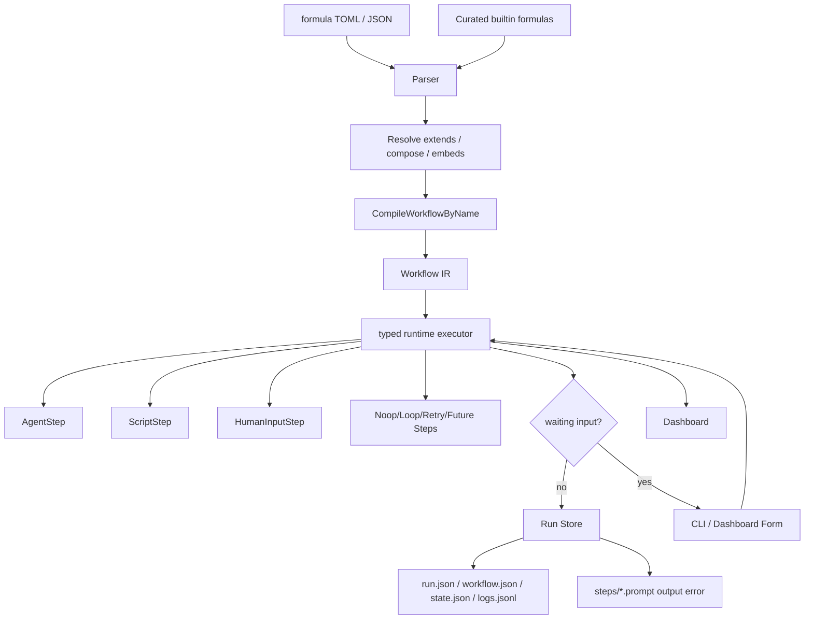
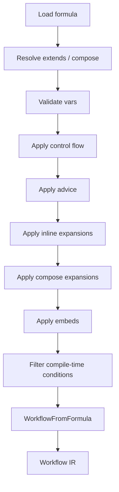
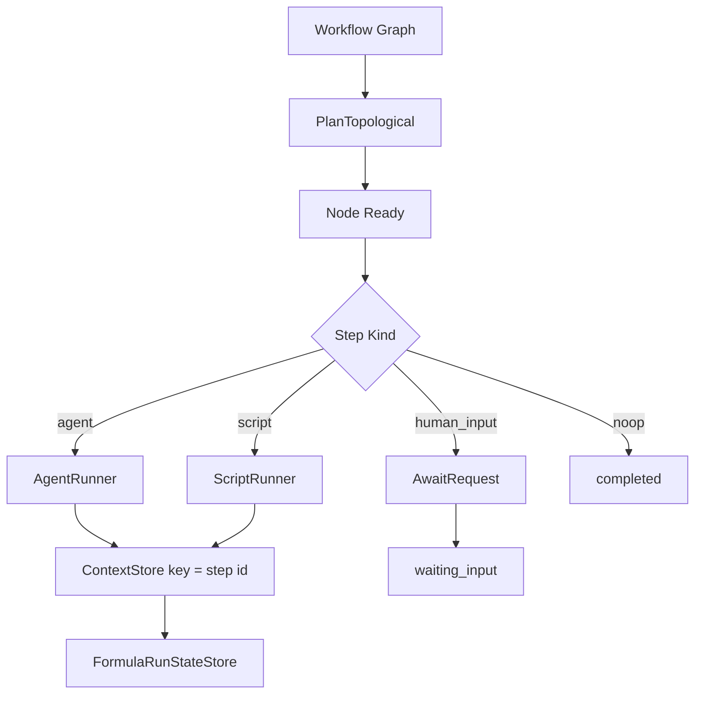

# Formula 工作流系统

`tt formula` 现在是一个 graph-first typed workflow 引擎。它不再通过旧的 task tree 中间模型执行，而是把声明式 TOML 直接解析、展开并编译成 `internal/formula/ir.Workflow`，再由 typed runtime 执行具体的 `steps.Step` 实现。

## 一句话结论

> Formula = TOML 定义 + Workflow IR 编译 + Step 接口实现 + typed runtime 调度 + run store/dashboard 可观察性。

## 系统总图



四段链路：

1. **定义阶段**：作者写 formula TOML。
2. **编译阶段**：解析继承、组合、扩展、嵌入和 compile-time condition，生成 `Workflow`。
3. **执行阶段**：typed runtime 按依赖图运行具体 Step 实现。
4. **观察阶段**：run store 和 dashboard 持续展示、恢复、提交人工输入。

## 定义模型

核心源文件：`internal/formula/types.go`。

顶层 `Formula` 包含：

- `formula` / `description` / `version` / `type`
- `vars`
- `steps`
- `template`
- `compose`
- `advice`
- `pointcuts`
- `phase`
- `pour`

一个 `Step` 可以声明：

- `id` / `title` / `description`
- `depends_on` / `needs`
- `condition`
- `children`
- `gate`
- `loop`
- `retry`
- `agent`
- `script`
- `input_context`
- `execution`
- `form`
- `validate`

当前推荐：用 step `id` 作为输出上下文 key。普通公式不要再写 `output_key`。

## 编译模型：Formula 到 Workflow

源码入口：`internal/formula/workflow.go`。

主线是：

1. `LoadByName`
2. `Resolve`
3. runtime vars 校验
4. compile-time vars 校验
5. `ApplyControlFlowWithVars`
6. `ApplyAdvice`
7. `ApplyInlineExpansionsWithVars`
8. `ApplyExpansionsWithVars`
9. `ApplyEmbedsWithVars`
10. `FilterStepsByCondition`
11. `WorkflowFromFormula`



`Workflow` 是执行器视角的数据结构：

- `ID` / `Name` / `Description`
- `Vars`
- `Graph.Nodes`
- `Graph.Edges`

每个 node 持有一个 `steps.Step` 接口实例，而不是旧的扁平任务结构。

## Step 接口与实现

核心接口：`internal/formula/steps/step.go`。

```go
type Step interface {
    Meta() Metadata
    Validate(ValidationContext) error
}

type Executable interface {
    Step
    Run(context.Context, RunRequest) (*RunResult, error)
}
```

现有实现集中在 `internal/formula/steps/kinds.go`：

- `NoopStep`
- `AgentStep`
- `ExternalAgentStep`
- `ScriptStep`
- `HumanInputStep`
- `LoopStep`
- `RetryStep`

其中 agent/external_agent/script/human_input/noop 已经是直接运行路径，Loop/Retry 是面向扩展的 typed step 结构。

`ExternalAgentStep` 用于把某一步交给外部 agent CLI 执行，内置 driver 包括 `jcode`、`codex`、`opencode`、`forge`、`bl`。旧版 recipe TOML 写法：

```toml
[[steps]]
id = "external-review"
execution = "external_agent"
description = "Review the current diff and return risks."
input_context = ["collect-diff"]

[steps.external_agent]
driver = "codex"
model = "gpt-5"
mode = "exec"
timeout = "5m"
extra_args = ["--sandbox", "read-only"]
```

新版 typed schema 写法使用 `kind = "external_agent"`，并把 driver 字段放在 step 顶层：

```toml
[[steps]]
id = "external-review"
kind = "external_agent"
prompt = "Review the current diff and return risks."
input_context = ["collect-diff"]
driver = "codex"
model = "gpt-5"
mode = "exec"
timeout = "5m"
```

注意：`codex` 的 resume 通过 `codex exec resume <session>`；`forge` 使用顶层 `forge --prompt` / `--conversation-id`，当前不注入 `--model`，默认使用 forge 安装/配置时已调配好的 provider 和 model。

外部 CLI 依赖建议用 conditional preflight 表达，`condition` 使用 compile-time 变量语法：

```toml
[[preflight.checks]]
type = "command"
name = "codex"
command = "codex"
condition = "{{driver}} == codex"
message = "driver=codex 时需要安装 Codex CLI。"
```

## 运行模型

核心执行器：`internal/formula/runtime/executor.go`。

执行器做三件事：

1. 对 `Workflow.Graph` 做拓扑规划。
2. 按 node 找到对应 Step 实现并执行。
3. 把结果写入 runtime context 和 run store。



## 数据流：step id 就是输出 key

运行时默认把步骤输出写到以 step `id` 命名的 context key。后续步骤用：

```toml
input_context = ["fetch-pr", "review-risk"]
condition = "classify.kind == frontend"
```

不要为新 formula 写 `output_key`。稳定、语义化的 step id 就是最好的上下文键。

## 人工输入模型

### 动态澄清，推荐用于不确定缺失信息

agent step 可声明：

```toml
form = true
```

runtime 会向 agent prompt 注入 `tt-human-input` 协议。如果 agent 输出该 fenced block，当前 step 进入 `waiting_input`，用户提交后该 step 以提交内容作为输出继续。

### 静态 human_input，只用于确定存在的用户门禁

```toml
[[steps]]
id = "choose-option"
execution = "human_input"

[steps.form]
title = "Choose an option"

[[steps.form.fields]]
name = "option"
label = "Option"
type = "radio"
required = true
options = ["safe", "fast", "complete"]
```

静态 form 适合审批、明确选项、必须由用户提供的私有上下文。不要把它当成默认澄清机制。

## 持久化模型

每次运行目录：

```text
.tt/runs/formula/<formula>/<run-id>/
  run.json
  workflow.json
  state.json
  logs.jsonl
  steps/
    <step>.prompt.md
    <step>.output.md
    <step>.error.txt
    <step>.human_input_request.json
    <step>.human_input_response.json
```

| 文件 | 用途 |
| --- | --- |
| `run.json` | 本次运行的元数据、状态、参数、工作区、session。 |
| `workflow.json` | 本次真正执行的 Workflow IR。 |
| `state.json` | runtime/dashboard 当前快照。 |
| `logs.jsonl` | 事件流。 |
| `steps/*` | 每个 step 的 prompt、输出、错误和人工输入文件。 |

## Dashboard

Dashboard 使用 `internal/formulaui` 的 UI DTO，从 `Workflow` 构建图展示。它负责：

- 展示步骤状态。
- 展示 prompt/output/error。
- 展示运行日志。
- 处理动态或静态人工输入表单。
- 支持失败步骤 retry。
- 打开历史 run 的只读视图。

## 命令入口

主要命令在 `cmd/formula/`：

- `tt formula list`
- `tt formula show`
- `tt formula validate`
- `tt formula compile`
- `tt formula run`
- `tt formula run resume`
- `tt formula run input`
- `tt formula run open`
- `tt formula create`
- `tt formula optimize`

`compile` 输出的是 Workflow 视角，`run` 直接走 typed runtime。

## 读源码顺序

1. `internal/formula/types.go`，作者侧语法模型。
2. `internal/formula/workflow.go`，Formula 到 Workflow 的主编译链路。
3. `internal/formula/ir/workflow.go`，Workflow IR。
4. `internal/formula/steps/step.go` 和 `kinds.go`，Step 接口和实现。
5. `internal/formula/runtime/executor.go`，运行时调度。
6. `internal/formularun/store.go`，运行持久化。
7. `internal/formulaui/` 和 `internal/formuladoc/`，展示和文档 DTO。
8. `cmd/formula/`，CLI 编排和 dashboard glue。

## 当前设计原则

- 不保留旧 task tree 兼容层。
- 用 Step 接口扩展新能力，而不是在一个大结构里继续堆字段。
- 新公式默认使用 step id 作为输出 key。
- 动态澄清优先于预设静态澄清表单。
- run store 保存 `workflow.json` 作为执行快照。
