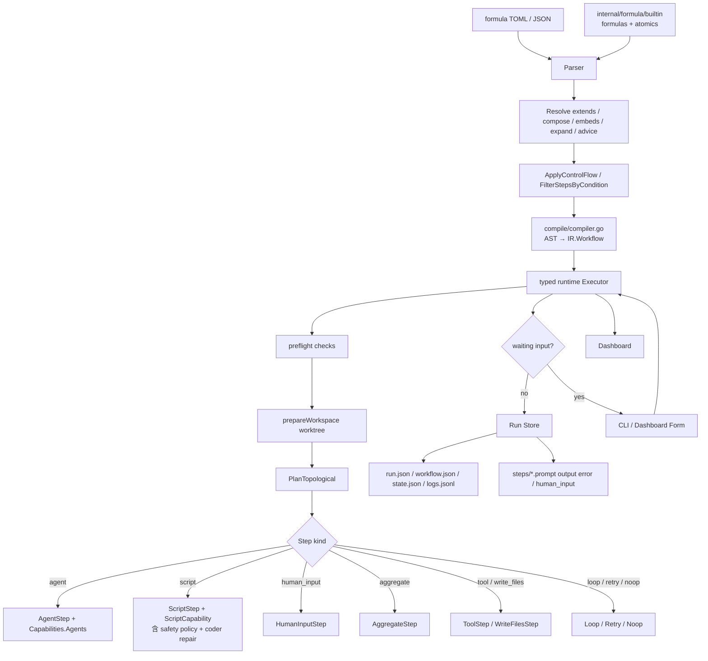
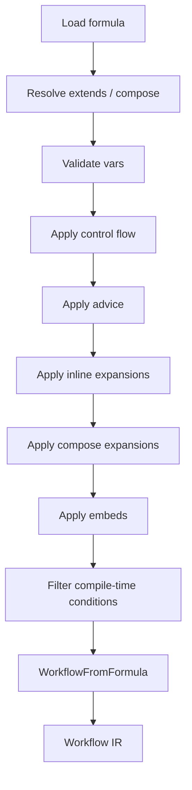

# Formula 工作流系统

> 最后更新：2026-06-05

`tt formula` 现在是一个 graph-first typed workflow 引擎。它不再通过旧的 task tree 中间模型执行，而是把声明式 TOML 直接解析、展开并编译成 `internal/formula/ir.Workflow`，再由 typed runtime 执行具体的 `steps.Step` 实现。

## 一句话结论

> Formula = TOML 定义 + Workflow IR 编译 + Step 接口实现 + typed runtime 调度 + run store/dashboard 可观察性。

## 系统总图



五段链路：

1. **定义阶段**：作者写 formula TOML（用户目录或 `internal/formula/builtin/`）。
2. **编译阶段**：解析继承、组合、扩展、嵌入、advice、compile-time condition；用 `internal/formula/compile/compiler.go` 把 AST 编译成 `ir.Workflow`，节点上挂 typed `steps.Step`。
3. **预检与 workspace 准备**：`preflight` 检查 + `prepareWorkspace`（按 `WorkspaceSpec` 创建 worktree/分支/sparse checkout）。
4. **执行阶段**：typed runtime 按依赖图运行具体 Step 实现。包含 runtime condition、loop/until、output validation advice、**StepFixer 自我修复**（agent / script 走统一抽象，最多 3 次 attempt，按 kind 默认 `idempotent` 决定是否重试）。
5. **观察阶段**：run store + dashboard 持续展示、恢复、提交人工输入；自我修复产生的 `RepairRecord` 持久化到 `patches/<run-id>.json`，dashboard `Repairs` 面板提供人工 `Confirm reviewed` 流。

## 定义模型

核心源文件：`internal/formula/types.go`。

顶层 `Formula` 包含：

- `formula` / `description` / `title` / `category` / `tags` / `version` / `type` / `contract`
- `vars`（变量声明，也是 Formula 的公开输入契约）
- `outputs`（Formula 的公开输出契约）
- `steps` / `template`（steps 与 expansion template）
- `compose`（bond_points / hooks / expand / map / branch / gate / aspects）
- `advice` / `pointcuts`
- `extends`
- `phase` / `pour` / `worktree` / `workspace`（执行策略）
- `preflight`（预检）
- `source`（由 parser 填入，运行时回溯来源）

一个 `Step` 可以声明：

- `id` / `title` / `description` / `description_file` / `notes`
- `type` / `priority` / `labels` / `metadata` / `assignee`
- `depends_on` / `needs` / `waits_for`
- `condition`（compile-time 与 runtime 共用，runtime 时支持 `==`/`!=`/`=~`）
- `children`（子步骤）
- `gate` / `loop` / `on_complete` / `retry` / `timeout`
- `agent` / `script` / `aggregate` / `tool` / `write_files` / `form` / `dynamic_form`
- `formula` / `with`（把另一个 Formula 作为运行时复合 step 调用，并显式绑定输入）
- `validate`（output schema）
- `output_key`（可选；推荐用 step `id`）
- `input_context`
- `execution`（`agent` / `script` / `human_input` / `formula` / `aggregate` / `tool` / `write_files` / `noop`）
- `expand` / `expand_vars` / `embed` / `embed_vars`

当前推荐：用 step `id` 作为输出上下文 key。普通公式不要再写 `output_key`。

Formula 可以把内部 context path 映射成稳定的公开输出：

```toml
[outputs.report]
from = "final-report"
type = "markdown"
required = true
description = "对调用方公开的最终报告"
```

- `from` 必填，通常填写 step `id` 或显式 `output_key`。
- `required = true` 时，workflow 在成功结束前必须产生该 context value，否则整个 run 失败。
- 未产生的 optional output 不会出现在 runtime `RunResult.Outputs` 中。
- `extends` 会继承父 Formula 的 outputs；子 Formula 用同名 output 覆盖父定义。
- 调用方应只依赖公开 output 名，不应依赖 Formula 的内部 step ID。`embed` 仍是编译期 inline；运行时复用应优先使用 `execution = "formula"`，它通过公开 vars/outputs 契约隔离父子 Formula。

## 编译模型：Formula 到 Workflow

源码入口：`internal/formula/workflow.go`。

主线是：

1. `LoadByName`
2. `Resolve`
3. runtime vars 校验
4. compile-time vars 校验
5. `ApplyControlFlowWithVars`
6. `ApplyAdvice`
7. `ApplyInlineExpansionsWithVars`
8. `ApplyExpansionsWithVars`
9. `ApplyEmbedsWithVars`
10. `FilterStepsByCondition`
11. `WorkflowFromFormula`



`Workflow` 是执行器视角的数据结构：

- `ID` / `Name` / `Description`
- `Vars`
- `Outputs`
- `Graph.Nodes`
- `Graph.Edges`

每个 node 持有一个 `steps.Step` 接口实例，而不是旧的扁平任务结构。

### 结构化执行路径

具体运行实例除兼容字符串 `address` 外，还携带结构化 execution path：

```text
step(review) / iteration(2) / step(check)
step(implementation) / formula(coding) / step(review)
```

path segment 的 kind 为 `step` / `iteration` / `formula`。旧的
`review.iter2.check` 地址继续保留并可无损解析，因此已有 run artifact、dashboard
链接和 session key 不需要迁移。Runtime `StepState` 与 `Event` 都保存结构化 path；
loop body 的具体运行实例也会进入 StateStore，不再只存在于事件日志中。
FormulaCall 使用同一 path 模型表达调用层级，例如
`implementation.formula(coding).review`，父子状态因此可以在同一 run 中恢复和展示。

### 运行变量来源与默认 vars 文件

`tt formula run` 的变量合并顺序是：

1. 默认 vars 文件（仅当没有显式传 `--file` 时自动查找）。
2. 显式 `--file <path>` 中的变量。
3. CLI `--var key=value` 覆盖。
4. positional required var 覆盖，例如 `tt formula run web-feature-test <url>` 会按 formula 的 required vars 顺序补值。

默认 vars 文件用于减少高频 formula 的长参数输入。运行：

```bash
tt formula run web-feature-test "https://example.com/case"
```

且未传 `--file` 时，CLI 会按顺序查找：

```text
.tt/formula/web-feature-test.toml
.tt/formula/web-feature-test.vars.toml
.tt/web-feature-test.toml
```

文件格式复用 `--file`，既可以写 `[vars]`，也可以把标量变量写在顶层：

```toml
prompt = """
只测试 Probe 相关功能点。
"""
max_cases = 10
only_failed = false

[vars]
screenshot_mode = "failures"
```

如果默认 vars 文件包含 `formula = "..."`，它必须与命令行选择的 formula 名一致，否则会报错，避免误读其他 formula 的配置。`.tt/formulas/` 仍保留为自定义 formula 定义目录，不用于默认 vars 文件，避免配置文件与 formula 定义冲突。

## Step 接口与实现

核心接口：`internal/formula/steps/step.go`。

```go
type Step interface {
    Meta() Metadata
    Validate(ValidationContext) error
}

type Executable interface {
    Step
    Run(context.Context, RunRequest) (*RunResult, error)
}
```

现有实现集中在 `internal/formula/steps/kinds.go`：

- `NoopStep`
- `AgentStep`（含 `DynamicForm` 协议注入 + `Formula step execution guard` 抗漂移）
- `ExternalAgentStep`
- `ScriptStep`（通过 `Capabilities.Scripts` 执行，注入 `env`）
- `HumanInputStep`（静态 Form）
- `LoopStep`（嵌套 typed step，支持 parallel / max_concurrency / for_each / until / range）
- `RetryStep`（attempt / on_exhausted）
- `AggregateStep`（基于已有 context 的投影/收集）
- `ToolStep`（deterministic 内建工具：write_files / sleep / git_*）
- `WriteFilesStep`（按 JSON 字段写入文件）
- `FormulaCallStep`（通过 `Capabilities.Workflows` 递归执行子 Formula，显式绑定 vars 并收集公开 outputs）

其中 agent/external_agent/script/human_input/noop 已经是直接运行路径，Loop/Retry/Aggregate/Tool/WriteFiles 是面向扩展的 typed step 结构。

`ExternalAgentStep` 用于把某一步交给外部 agent CLI 执行，内置 driver 包括 `jcode`、`codex`、`opencode`、`forge`、`bl`。旧版 recipe TOML 写法：

```toml
[[steps]]
id = "external-review"
execution = "external_agent"
description = "Review the current diff and return risks."
input_context = ["collect-diff"]

[steps.external_agent]
driver = "codex"
model = "gpt-5"
mode = "exec"
timeout = "5m"
extra_args = ["--sandbox", "read-only"]
```

新版 typed schema 写法使用 `kind = "external_agent"`，并把 driver 字段放在 step 顶层：

```toml
[[steps]]
id = "external-review"
kind = "external_agent"
prompt = "Review the current diff and return risks."
input_context = ["collect-diff"]
driver = "codex"
model = "gpt-5"
mode = "exec"
timeout = "5m"
```

注意：`codex` 的 resume 通过 `codex exec resume <session>`；`forge` 使用顶层 `forge --prompt` / `--conversation-id`，当前不注入 `--model`，默认使用 forge 安装/配置时已调配好的 provider 和 model。

外部 CLI 依赖建议用 conditional preflight 表达，`condition` 使用 compile-time 变量语法：

```toml
[[preflight.checks]]
type = "command"
name = "codex"
command = "codex"
condition = "{{driver}} == codex"
message = "driver=codex 时需要安装 Codex CLI。"
```

`Step` 的 kind 枚举（`internal/formula/steps/step.go`）：

```go
const (
    KindNoop          Kind = "noop"
    KindAgent         Kind = "agent"
    KindExternalAgent Kind = "external_agent"
    KindScript        Kind = "script"
    KindHumanInput    Kind = "human_input"
    KindLoop          Kind = "loop"
    KindCondition     Kind = "condition"
    KindGate          Kind = "gate"
    KindRetry         Kind = "retry"
    KindEmbed         Kind = "embed"
    KindExpand        Kind = "expand"
    KindTool          Kind = "tool"
    KindAggregate     Kind = "aggregate"
    KindWriteFiles    Kind = "write_files"
    KindFormula       Kind = "formula"
)
```

更详细的 step kind 写法、字段含义和示例见 [step-kinds-reference.md](./step-kinds-reference.md)。

## 运行模型

核心执行器：`internal/formula/runtime/executor.go`。

执行器做的事：

1. 调用 `e.Store.StartWorkflow` 并触发 `workflow.started` 事件。
2. 调用 `prepareWorkspace`（按 `WorkspaceSpec` 创建 worktree / 分支 / 稀疏 checkout），并触发 `workflow.workspace.ready` 事件。
3. 调用 `PlanTopological` 得到执行顺序。
4. 对每个 node：先恢复上次已完成 step 的结果；用 `shouldRunStep` 评估 runtime condition；用对应 `Step` 实现执行；按 status 处理：
   - `completed` → 把输出写入 `ContextStore`（key = step id 或 `output_key`）+ `SaveStep` + `step.completed`
   - `waiting` → 标记 `waiting_input` 并停机
   - `failed` / output 校验失败 → 调用 `tryFixAndRerun` 走 **StepFixer 抽象**：按 step kind 选 `agentFixer` / `scriptFixer`（agent 默认 idempotent,script 默认非幂等），最多 `maxFixAttempts = 3` 次 attempt，attempt-aware advice 升级 prompt；写 `RepairRecord` 到 state，再落盘到 `patches/<run-id>.json`，并通过 `step.repair.recorded` 事件推到 dashboard
5. 结束时 `FinishWorkflow` + `workflow.completed`/`failed` 事件；并 `finalizeWorkspace`（按 cleanup 策略删除临时 worktree）。

```mermaid
flowchart TD
    A[Workflow Graph] --> B[prepareWorkspace]
    B --> C[PlanTopological]
    C --> D[Node Ready]
    D --> E{Step Kind}
    E -->|agent| F[AgentRunner]
    E -->|script| G[ScriptRunner + safety policy]
    E -->|human_input| H[AwaitRequest]
    E -->|aggregate / tool / write_files| I[Aggregate / Tool / WriteFilesRunner]
    E -->|noop| J[completed]
    F --> K[ContextStore key = step id]
    G --> K
    G -. failed / 校验失败 .-> R[StepFixer 抽象<br/>agentFixer / scriptFixer]
    F -. failed / 校验失败 .-> R
    R -. idempotent? .-> S{Idempotent<br/>(agent 默认 true<br/>script 默认 false)}
    S -->|yes| T[最多 3 次 attempt<br/>attempt-aware advice]
    S -->|no| Sk[skipped_non_idempotent]
    T --> F
    T --> G
    T --> Rep[RepairRecord → state +<br/>patches/<run-id>.json]
    Rep --> Dash[Dashboard Repairs 面板]
    H --> L[waiting_input]
    K --> M[FormulaRunStateStore]
```

## 自我修复（Self-Repair）

失败不应止于一条错误日志。typed runtime 把"agent / script step 失败 → 自动调整 → 再跑"作为一等公民能力。

### StepFixer 抽象

`internal/formula/runtime/stepfixer.go` 定义了一个 `StepFixer` 注册表：

```go
type StepFixer interface {
    Kind() string                  // agent / script
    AllowFix(step) bool            // 是否可重试（受 idempotent 约束）
    Fix(ctx, fixerContext) (FixReport, error)
}

type FixReport struct {
    Advice            string // 注入到下一次 attempt prompt 的建议
    FormulaUpdateHint string // 持久化到 RepairRecord，给作者回写 formula
    NextAttemptHint   string // 给执行器的下一步提示
    OriginalCommand   string // script 专用
    FixedCommand      string // script 专用
}
```

实现：

- `agentFixer` —— agent step 失败或 validation 失败时使用，让 agent 用更新后的 prompt（含 Advice + 自检要点）再生成。`attempt >= 2` 会附加 schema shape + self-check；`attempt >= 3` 进一步收紧到 "只输出一个紧凑 JSON 值"。
- `scriptFixer` —— script step 失败时使用，让 `coder` agent 产出 `fixed_command` 并重跑；产出 `OriginalCommand` / `FixedCommand` / `NextAttemptHint`。

注册表按 step kind 派发，未来加 `toolFixer` / `externalAgentFixer` 只需注册到 `DefaultFixerRegistry`，无需改 executor。

### Idempotent 旗标

每个 step 都可声明 `idempotent = true|false`（typed schema `StepDecl.Idempotent` + recipe TOML 的 step-level 字段）。runtime 把它透传到 `steps.Metadata.Idempotent`，executor 在 `stepAllowsFix` 中按 kind 决定默认值：

| Step kind | 默认 `idempotent` | 含义 |
| --- | --- | --- |
| `agent` | `true` | LLM 调用可重复，不会留下持久副作用 |
| `external_agent` | `true` | 同样为外部 LLM 调用，视为可重试 |
| `script` | `false` | shell / 子进程可能产生副作用（写文件、push、删资源），必须**显式**写 `idempotent = true` 才允许自动重试 |
| `tool` / `aggregate` / `write_files` / `noop` / `human_input` / `loop` / `retry` | 不走 fix 路径 | —— |

设置示例：

```toml
# 显式声明可重试
[[steps]]
id = "fetch-pr"
execution = "script"
idempotent = true        # script 默认 false；只有写在这里才会自修

[steps.script]
command = ["gh", "pr", "view", "{{pr}}", "--json", "number,title"]
```

> 写法提示：凡 `gh`、`curl`、`jq`、`go test`、`git fetch` / `git status` / `git diff` 这类**只读或幂等写**的命令，写 `idempotent = true`；发 push / 写产物 / 删资源等**有副作用**的命令保持默认（不写），失败时 runtime **直接终止**而不是自修。

### 重试循环：最多 3 次 attempt

`executor.tryFixAndRerun` 是核心循环：

```text
for attempt in 1..maxFixAttempts:        // maxFixAttempts = 3
    if not stepAllowsFix(step):          // 非幂等 → 终止
        return skipped_non_idempotent
    report = fixer.Fix(ctx, lastError, lastResult, attempt)
    if report is invalid: return invalid_fix
    res, err = rerun(step, advice=report.Advice)
    recordRepair(...)                    // 写 RepairRecord
    if res is completed / waiting: return succeeded
return exhausted
```

`maxFixAttempts` 当前是编译期常量（`internal/formula/runtime/executor.go`），后续 phase 会做成可配 `StepDecl.MaxFixAttempts`。

### RepairRecord 持久化

每次 attempt 都生成一条 `RepairRecord`，结构（`internal/formula/runtime/state.go` + `internal/formula/ui/state.go`）：

```text
StepID / Kind / Attempt / Status / Reason
Advice / FormulaUpdateHint / NextAttemptHint
OriginalCommand / FixedCommand
Error
RecordedAt / ConfirmedAt / ConfirmationStatus
```

Status 枚举：

- `skipped_non_idempotent` —— step 默认非幂等，未走 fix
- `fix_error` / `no_fix` / `invalid_fix` —— fixer 失败
- `waiting` —— 等待下一次 attempt
- `succeeded` —— fix 后重跑成功
- `attempt_failed` —— fix 后重跑仍失败
- `exhausted` —— 3 次 attempt 全部失败

记录流向：

```text
executor.recordRepair → runtime.Snapshot.Repairs
                ↓
formula/run.Store.SaveRepairs  →  patches/<run-id>.json
                ↓
cmd/formula dashboard event sink (step.repair.recorded) →  websocket
                ↓
frontend RepairsPanel.tsx  →  /api/repairs/confirm POST → 标记 ConfirmedAt
```

`patches/<run-id>.json` 与 `state.json` 解耦：状态可读，patch artifact 可被 git diff / code review / 自动 apply 单独消费。

### Dashboard 接入

- `RunOverview` 新增 `Repairs` 计数。
- `RepairsPanel` 列出每条 repair：reason / hint / fixed command / attempt。
- 每条 panel 可点击 `Confirm reviewed` 调 `POST /api/repairs/confirm`，服务端把 `ConfirmationStatus = "confirmed"` + `ConfirmedAt` 写回 `patches/<run-id>.json`。
- **runtime 不会自动 patch formula 文件**。`FormulaUpdateHint` 提示作者该改哪段 TOML / schema，由人审阅后用 `tt formula create` / `optimize` 重新生成。

### 选型决策（2026-06-05）

- 走"**抽象 + 升级现有机制**"而不是新建独立 `formula-fix` agent：executor 内部已存在两套修复（agent validation retry + script command repair），抽象成 `StepFixer` 注册表后，未来加新 fixer 不会影响执行路径。
- **Idempotent 默认值按 kind 决定**：agent 默认 true（LLM 可重试），script 默认 false（命令可能产生副作用），与 `tryRepairFailedScriptStep` 行为一致，但更严格。
- **`patches/<run-id>.json` 独立文件**：避免污染 `state.json`，让 patch artifact 可被 `git diff` / 后续自动 apply 工具消费。
- **人工 confirm 必经**：`ConfirmationStatus` 由 dashboard API 写入，runtime / executor 不会替作者确认。

## 数据流：step id 就是输出 key

运行时默认把步骤输出写到以 step `id` 命名的 context key。后续步骤用：

```toml
input_context = ["fetch-pr", "review-risk"]
condition = "classify.kind == frontend"
```

不要为新 formula 写 `output_key`。稳定、语义化的 step id 就是最好的上下文键。

`ContextStore` 还会自动注入 `env` 键，包含 `cwd` / `invocation_cwd` / `workspace_cwd` / `formula_run_dir` / `os.{name,arch}` / `git.{is_repo,root,repo,branch,commit,remote_url}`。可以在 `description` / `prompt` 中通过 `{{env.git.branch}}` 等模板引用，也可以在 `condition` 中使用 `env.git.is_repo == true` 这样的判断（注意 `true` 在 `=`/正则上下文会被序列化为字符串 `"true"`，请用 `==` 显式写出）。

## 预检（preflight）

Formula 可以在 `[preflight]` 段声明启动前必过的检查，类型支持：

- `command` —— 仅检查可执行文件是否存在（不做调用）
- `exec` —— 真正执行命令验证可用性
- `git` —— 检查 `require_repo` / `require_remote` 等状态
- `env` —— 检查环境变量是否存在
- `path` —— 检查文件 / 目录是否存在

`bug-detect` 与 `github-pr-review` 等内置 formula 都依赖 preflight；缺失必要 CLI（`jira` / `gh`）会立即终止运行并提示安装。

## 人工输入模型

### 动态澄清，推荐用于不确定缺失信息

agent step 可声明：

```toml
form = true
```

runtime 会向 agent prompt 注入 `tt-human-input` 协议。如果 agent 输出该 fenced block，当前 step 进入 `waiting_input`，用户提交后该 step 以提交内容作为输出继续。

### 静态 human_input，只用于确定存在的用户门禁

```toml
[[steps]]
id = "choose-option"
execution = "human_input"

[steps.form]
title = "Choose an option"

[[steps.form.fields]]
name = "option"
label = "Option"
type = "radio"
required = true
options = ["safe", "fast", "complete"]
```

静态 form 适合审批、明确选项、必须由用户提供的私有上下文。不要把它当成默认澄清机制。

## 持久化模型

每次运行目录：

```text
.tt/runs/formula/<formula>/<run-id>/
  run.json
  workflow.json
  state.json
  logs.jsonl
  steps/
    <step>.prompt.md
    <step>.output.md
    <step>.error.txt
    <step>.human_input_request.json
    <step>.human_input_response.json
```

| 文件 | 用途 |
| --- | --- |
| `run.json` | 本次运行的元数据、状态、参数、工作区、session。 |
| `workflow.json` | 本次真正执行的 Workflow IR。 |
| `state.json` | runtime/dashboard 当前快照。 |
| `logs.jsonl` | 事件流。 |
| `steps/*` | 每个 step 的 prompt、输出、错误和人工输入文件。 |

## Dashboard

Dashboard 使用 `internal/formula/ui` 的 UI DTO，从 `Workflow` 构建图展示。它负责：

- 展示步骤状态。
- 展示 prompt/output/error。
- 展示运行日志。
- 处理动态或静态人工输入表单。
- 支持失败步骤 retry。
- 打开历史 run 的只读视图。

## 命令入口

主要命令在 `cmd/formula/`：

- `tt formula list [--builtin] [--user] [--category ...]`
- `tt formula show <name> [--markdown]`
- `tt formula compile <name>`（输出 typed `ir.Workflow` 视角的快照）
- `tt formula validate <file>`
- `tt formula copy <name> [output]`
- `tt formula run <name> [positional]`
  - 旗标：`--agent`、`--model`、`--session`、`--web/--no-web`、`--web-port`、`--dry-run`、`--no-save`、`--no-script`、`--allow-shell-script`
  - 子命令：`open` / `show` / `rm` / `resume` / `input`
- `tt formula runs [--limit N] [--formula ...] [--status ...]`
- `tt formula create <name> <prompt...>`
- `tt formula optimize <name> <suggestion...>`

`compile` 输出的是 typed Workflow 视角；`run` 直接走 typed runtime；`create` / `optimize` 走嵌入式 `formula-writer` agent。

## 读源码顺序

1. `internal/formula/types.go`，作者侧语法模型。
2. `internal/formula/parser.go`，formula 解析。
3. `internal/formula/workflow.go`，Formula 到 typed `ir.Workflow` 的主编译链路（含 control flow / advice / embed / expand / filter）。
4. `internal/formula/ast/document.go` 与 `internal/formula/ir/workflow.go`，AST 与 IR。
5. `internal/formula/compile/compiler.go`，第二条 AST→IR 编译路径（用 Step Registry）。
6. `internal/formula/steps/step.go` + `registry.go` + `kinds.go`，Step 接口、注册表与所有 step 实现。
7. `internal/formula/runtime/executor.go`，运行时调度。
8. `internal/formula/runtime/environment.go` / `workspace.go` / `capabilities.go`，env / worktree / script safety。
9. `internal/formula/run/store.go`，运行持久化。
10. `internal/formula/ui/` / `internal/formula/doc/` / `internal/formula/runview/`，展示和文档 DTO。
11. `cmd/formula/`，CLI 编排和 dashboard glue。

## 当前设计原则

- 不保留旧 task tree 兼容层。
- 用 Step 接口扩展新能力，而不是在一个大结构里继续堆字段。
- 新公式默认使用 step id 作为输出 key。
- 动态澄清优先于预设静态澄清表单。
- run store 保存 `workflow.json` 作为执行快照。
- agent step 强制注入 `Formula step execution guard`，避免 agent 只承认规则而不真做任务。
- **自我修复**走 `StepFixer` 抽象 + `idempotent` 旗标：agent 默认可重试、script 默认非幂等；失败 → 最多 3 次 attempt → attempt-aware advice 升级 → `RepairRecord` 落盘 `patches/<run-id>.json` → dashboard `Repairs` 面板 + 人工 `Confirm reviewed`。
- script step 永远走 `exec.CommandContext`，并默认拒绝 `rm -rf`、`shutdown`、`sudo` 等危险命令。
