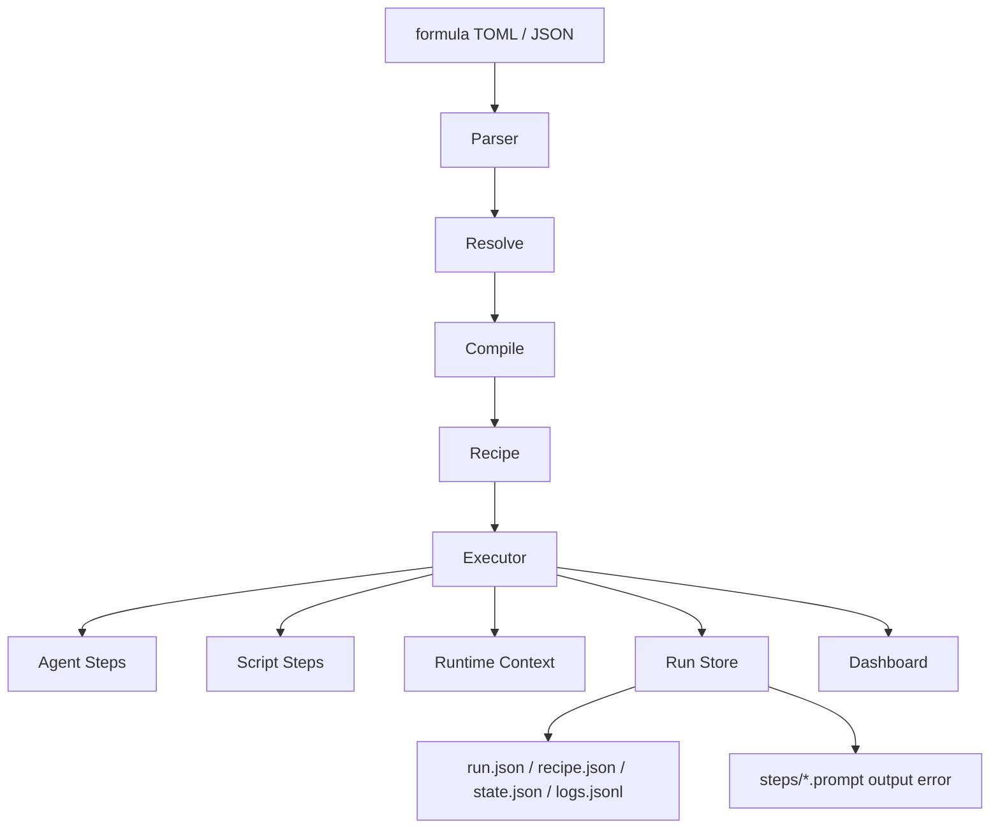
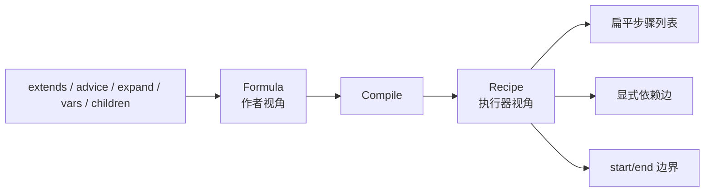
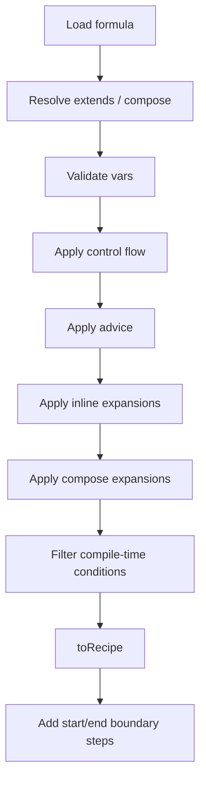
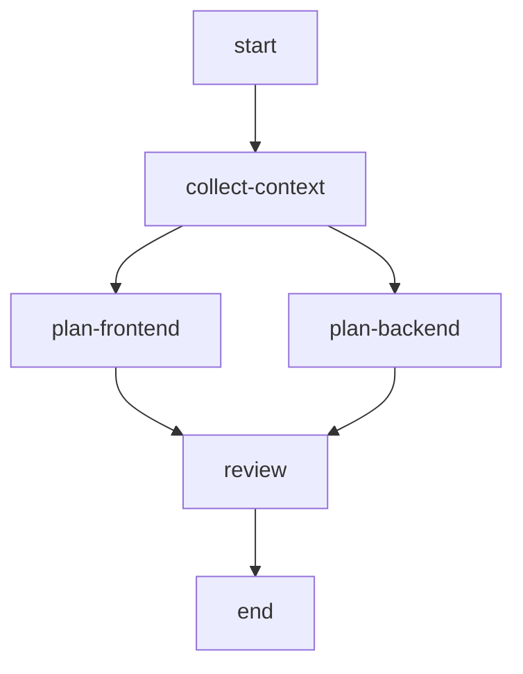
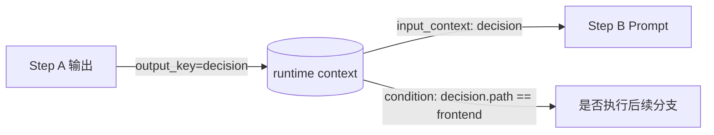
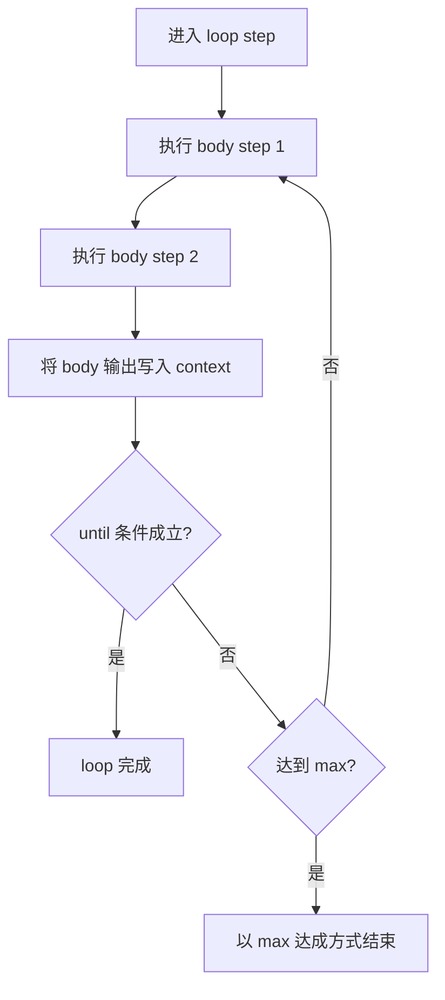
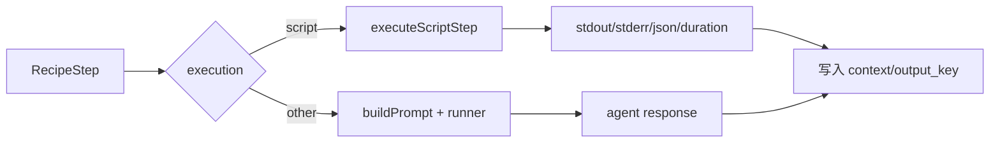
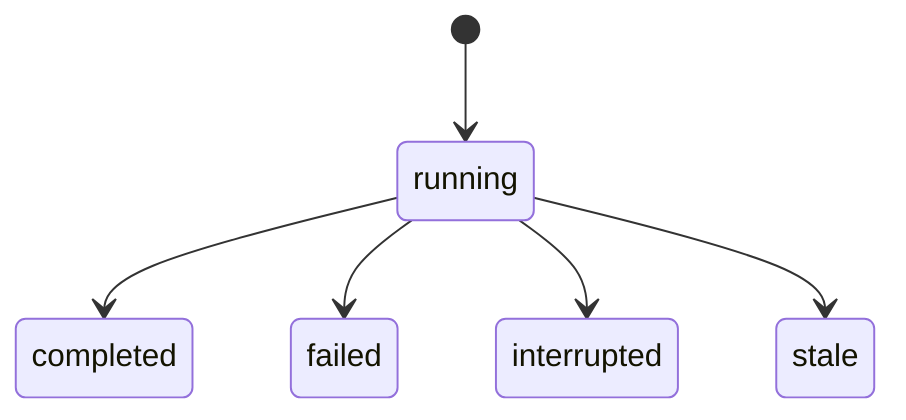

# Formula 工作流系统

`tt` 的 formula 子系统是整个仓库里最值得单独理解的部分。它已经不只是“模板生成器”，而是一个带有编译、执行、持久化和可视化能力的小型工作流引擎。

## 先给结论

如果要用一句话概括它：

> Formula 先把声明式工作流定义编译成 `Recipe` 依赖图，再由 executor 按 DAG 执行，期间把上下文、步骤产物和运行事件持续落盘，并可通过 dashboard 观察与恢复运行。

## 系统总图



读这张图时，可以把 formula 理解成四段链路：

1. **定义阶段**：写 formula 文件
2. **编译阶段**：把定义变成稳定的 Recipe 图
3. **执行阶段**：按 DAG 运行 agent/script 步骤
4. **观察阶段**：通过 run store 和 dashboard 回看或恢复运行

## Formula 定义模型

核心定义在 `internal/formula/types.go`。

### 顶层对象 `Formula`

它包含：
- `formula`：名称
- `description`
- `version`
- `type`：`workflow` / `expansion` / `aspect`
- `vars`
- `steps`
- `template`
- `compose`
- `advice`
- `pointcuts`
- `phase`
- `pour`

这里最重要的不是字段数量，而是它说明了：**formula 不是只有“步骤列表”，还支持继承、扩展、切面和组合。**

### 步骤对象 `Step`

一个步骤可以携带：
- `id` / `title` / `description`
- `depends_on` / `needs`
- `condition`
- `children`
- `gate`
- `loop`
- `retry`
- `agent`
- `script`
- `output_key`
- `input_context`
- `execution`

也就是说，step 已经是一个相当丰富的工作单元定义，而不是简单字符串任务。

## 编译前后：为什么要有 `Recipe`

源码中一个关键设计是：**执行器不直接跑 `Formula`，而是跑 `Recipe`。**

### 编译前：面向作者的 Formula
- 支持继承、扩展、切面、变量等高层表达
- 更适合手写和维护

### 编译后：面向执行器的 Recipe
- `Steps` 已扁平化
- `Deps` 已显式化
- start/end 边界已补齐
- 可直接做拓扑排序和批次执行



这张图说明：Recipe 的价值不只是“中间格式”，而是把高层定义降维成执行期更稳定的数据结构。

## 编译阶段做了什么

`internal/formula/compile.go` 的主线大致是：

1. `LoadByName` 载入 formula
2. `Resolve` 处理继承与组合
3. 校验变量
4. 准备 compile-time 变量
5. `ApplyControlFlowWithVars`
6. `ApplyAdvice`
7. `ApplyInlineExpansionsWithVars`
8. `ApplyExpansionsWithVars`
9. `FilterStepsByCondition`
10. `toRecipe`

## 编译阶段示意图



这张图回答的是：**一个 formula 文件到底怎样一步步变成可执行图。**

## 边界步骤：start / end 的设计意义

源码会在 `toRecipe()` 之后调用 `addRecipeBoundarySteps()` 自动补齐：

- `<formula>.start`
- `<formula>.end`

如果用户没显式定义，它们会以 `noop` 边界步骤出现。

这样做的好处有三个：

1. 所有图都有明确入口和出口。
2. 没有前驱/后继的真实步骤可以统一挂接。
3. Mermaid 图和 dashboard 展示会更稳定。

## 执行模型：DAG 分批执行

执行器在 `internal/executor/dag.go` 中先把 Recipe 转为拓扑批次：

- 同一批次：没有互相依赖，可以并发执行
- 下一批次：等待前一批完成后再执行



从这类图里，你应该读出的是：**executor 的并发单位不是 goroutine 随机并发，而是基于依赖图算出来的批次并发。**

## 运行时上下文：`output_key` 与 `input_context`

formula 的运行时数据流主要靠两组字段：

- `output_key`：把某一步输出写入上下文
- `input_context`：后续步骤把指定 key 的内容注入 prompt

执行器在 step 完成后，如果设置了 `output_key`，会把输出放入 `context`。后续 `buildPrompt()` 会按 `input_context` 提取这些值，拼进提示词。



这张图说明，formula 的数据流不是靠全局共享对象硬编码，而是靠显式命名的上下文键连接起来的。

## 条件执行：compile-time 与 runtime 的区别

这是这个子系统里非常值得先搞清楚的一点。

### compile-time condition
在编译期基于变量做过滤，步骤可能直接不进入最终 Recipe。

### runtime condition
在执行期根据上下文判断要不要跳过某个步骤。

执行器里 `shouldSkip()` 调用 `EvaluateCondition()`，支持：
- `==`
- `!=`
- `=~`
- `&&`
- `||`
- JSON path 风格访问，如 `decision.path`

## 循环：`loop.until` 的运行时语义

当步骤带有 `loop.until` 时，执行器不会把它当普通步骤，而会进入 `executeRuntimeLoop()`。

### loop 的特点
- 运行时循环
- 每次迭代都可执行 body steps
- body step 可以是 agent step，也可以是 script step
- 使用 `{{iteration}}` 渲染标题/描述
- 每轮结束后评估 `until`
- 达到 `max` 后停止



这里最重要的理解是：**loop 不是编译期展开 N 份步骤，而是执行期控制一个循环体。**

## agent step 与 script step

formula 支持两种主要执行方式。

### 1. agent step
- 默认模式
- executor 负责组装 prompt
- 通过 Picoclaw `DirectRunner` 调用 agent
- 支持 step 级 agent/model/session 覆盖

### 2. script step
- `execution == "script"`
- 使用 `ScriptSpec` 执行本地命令
- 支持 argv 形式命令
- shell 默认禁用，需显式允许
- 有命令 denylist 和危险模式拦截
- 可声明 stdout 必须是 JSON



这张图解释的是：**formula 执行器不是纯 LLM 调度器，它也能跑可控的本地确定性步骤。**

## 运行持久化：为什么它很重要

没有 `internal/formularun`，formula 只能算一次性执行；有了它，formula 才更像一个真正的工作流系统。

每次运行会生成目录：

```text
.tt/runs/formula/<formula>/<run-id>/
  run.json
  recipe.json
  state.json
  logs.jsonl
  steps/
    <step>.prompt.md
    <step>.output.md
    <step>.error.txt
```

### 这些文件分别回答什么问题

| 文件 | 回答的问题 |
| --- | --- |
| `run.json` | 这次运行是谁、何时、以什么参数启动的？ |
| `recipe.json` | 当时真正执行的 Recipe 长什么样？ |
| `state.json` | 当前/最终状态快照是什么？ |
| `logs.jsonl` | 执行过程中发生了哪些事件？ |
| `steps/*` | 每一步到底给了什么 prompt，得到了什么输出？ |

## 运行状态流转



`stale` 这个状态很有意思：如果一个 run 还标记为 running，但对应进程已经不存在，系统会把它标成 stale。这说明 run store 已经在承担“运行恢复”和“状态清理”的职责。

## Dashboard 的角色

formula 不只是把结果写盘，还会通过 dashboard 展示：

- 哪些步骤在运行
- 哪些已完成/失败
- 日志和输出
- Workspace 关联目录

因此 dashboard 不只是一个 UI 点缀，而是把“执行时可观察性”补齐的重要一环。

## create / optimize：让 formula 可以被 agent 生产

`cmd/formula.go` 里还有两个非常有代表性的命令：

- `formula create`
- `formula optimize`

它们通过内嵌 `formula-writer` agent：
- 根据自然语言请求生成 TOML
- 本地再次做 parse + validate
- optimize 失败时还能触发一次 repair 流程

这让 formula 系统不只是“运行工作流”，还具备了“让 agent 设计工作流”的能力。

## 读源码时最值得优先看的链路

如果你想快速进入主线，建议按下面顺序读：

1. `internal/formula/types.go`
2. `internal/formula/compile.go`
3. `internal/formula/recipe.go`
4. `internal/executor/dag.go`
5. `internal/executor/executor.go`
6. `internal/formularun/store.go`
7. `cmd/formula.go`
8. `cmd/formula_dashboard.go`

## 实现参考

- 定义模型：`internal/formula/types.go`
- 编译入口：`internal/formula/compile.go`
- Recipe 生成：`internal/formula/recipe.go`
- 条件执行：`internal/executor/dag.go`
- 执行器：`internal/executor/executor.go`
- 运行持久化：`internal/formularun/store.go`
- 命令编排：`cmd/formula.go`
- Dashboard：`cmd/formula_dashboard.go`
- 示例：`examples/formulas/*`
