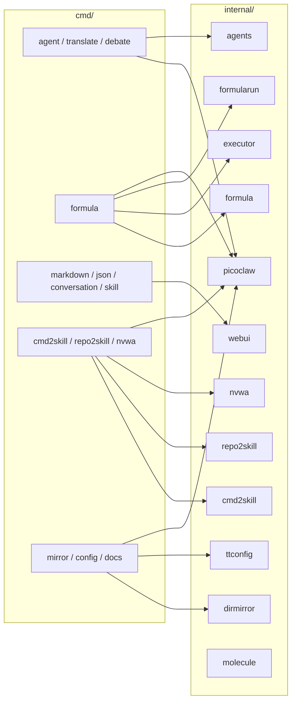
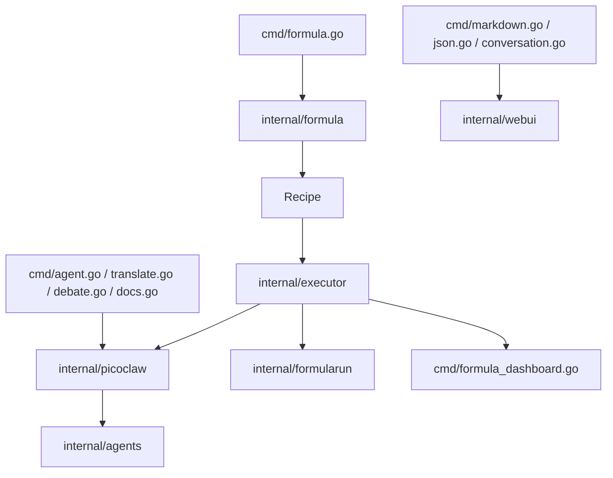

# 命令与模块地图

这篇文档解决一个很实际的问题：**当你准备改代码时，应该先去哪个目录找？**

`tt` 的能力面很宽，但代码组织并不混乱。整体上可以理解为：

- `cmd/` 负责把能力暴露成 CLI 命令
- `internal/` 负责具体实现
- `web/` 提供前端源码
- `internal/agents/embedded` 提供内嵌 agent 定义

## 先看总图



这张图的重点不是列全所有文件，而是建立一个判断：**你看到的命令，大多只是装配层，真正的复杂逻辑在 `internal/`。**

## `cmd/`：所有对外入口

### 根命令与公共辅助

| 文件 | 作用 |
| --- | --- |
| `cmd/root.go` | 根命令 `tt`，注册所有子命令 |
| `cmd/workspace.go` | 保证 `.tt` 工作区存在 |
| `cmd/config_helpers.go` | 配置辅助逻辑 |
| `cmd/picoclaw_helpers.go` | Picoclaw 配置与错误包装辅助 |
| `cmd/loading.go` | LLM 等待时的终端 loading 提示 |
| `cmd/version.go` | 输出版本 |

### 本地 Web UI 命令

| 文件 | 作用 |
| --- | --- |
| `cmd/markdown.go` | Markdown 浏览/预览 |
| `cmd/json.go` | JSON 浏览/编辑 |
| `cmd/conversation.go` | 会话型 JSON 浏览 |
| `cmd/formula_dashboard.go` | Formula 运行时 Dashboard 服务 |

这类命令通常会：
1. 解析路径 / 端口 / pattern
2. 启动本地 HTTP 服务
3. 挂载 `internal/webui` 中内嵌的前端资源
4. 暴露文件读写或运行状态接口

### Agent / LLM 命令

| 文件 | 作用 |
| --- | --- |
| `cmd/agent.go` | 通用 agent 入口 |
| `cmd/agent_info.go` | 查看解析后的 runtime 信息 |
| `cmd/translate.go` | 调用内嵌翻译 agent |
| `cmd/debate.go` | 多 agent 股票讨论 |
| `cmd/nvwa.go` | 生成 agent prompt / soul |
| `cmd/repo2skill.go` | 仓库到 skill 的生成命令 |
| `cmd/docs.go` | 代码分析并生成中文文档 |

这些命令的共同点是：**都会经过 `internal/picoclaw` 创建 DirectRunner，再把具体任务交给 agent。**

### Formula 命令

| 文件 | 作用 |
| --- | --- |
| `cmd/formula.go` | formula 全部子命令：list/show/compile/instantiate/validate/create/optimize/run/runs/open/show/rm/resume |
| `cmd/formula_dashboard.go` | formula 实时 dashboard |

`cmd/formula.go` 是仓库里最重的命令文件之一，因为它同时承担了：

- formula 搜索路径管理
- 变量解析
- compile / instantiate / validate
- create / optimize（通过 formula-writer agent）
- run / resume（通过 executor + picoclaw + formularun）
- Markdown 说明页生成（带 Mermaid 图）

### 工程辅助命令

| 文件 | 作用 |
| --- | --- |
| `cmd/cmd2skill.go` | CLI 转 skill |
| `cmd/mirror.go` | 配置目录镜像 |
| `cmd/config.go` | 查看 / 初始化 tt 配置 |

## `internal/`：真正的实现中心

## 1. `internal/picoclaw`

它是 `tt` 复用 Picoclaw 的核心适配层。

主要职责：
- 解析 Picoclaw home/config 路径
- 临时注入环境变量再加载 config
- 创建 provider、message bus、agent loop
- 注册 embedded agents
- 暴露 `DirectRunner.ProcessDirect()` 供各命令复用

最关键文件：
- `runtime.go`
- `direct.go`
- `agent.go`
- `embedded_agent.go`
- `resolve.go`
- `summary.go`

如果你在排查“某个命令为什么找不到模型 / agent / skill”，通常要先看这里。

## 2. `internal/agents`

它管理内嵌 agent 定义，数据来源是：

```text
internal/agents/embedded/*.md
```

这些 Markdown 文件带 YAML frontmatter，里面声明：
- agent id
- name
- soul
- skills
- 是否保留 history
- 是否启用 research tools

源码会把它们解析成 `pcwrap.EmbeddedAgent`。这意味着：**添加一个新内嵌 agent，通常不需要改大段 Go 逻辑，只需要新增一个规范化的 Markdown 定义文件。**

## 3. `internal/formula`

这是 formula 语言本体。它负责：

- 类型定义（`Formula`、`Step`、`LoopSpec`、`AgentConfig`、`ScriptSpec`）
- 解析 TOML / JSON
- 变量校验与默认值处理
- extends / expand / advice / control flow 解析
- compile-time 条件过滤
- 编译成 `Recipe`
- 自动补齐 start/end 边界步骤

关键文件：
- `types.go`
- `parser.go`
- `compile.go`
- `recipe.go`
- `condition.go`
- `controlflow.go`
- `expand.go`
- `advice.go`

## 4. `internal/executor`

这是 formula 的执行引擎。它并不关心“公式文件长什么样”，只关心“已经编译好的 Recipe 如何运行”。

它负责：
- 计算拓扑批次（topological batches）
- 并发执行同批步骤
- 判断运行时 condition
- 执行 agent step 或 script step
- 维护运行中 context
- 处理 loop.until 循环
- 产出 `RunResult`

关键文件：
- `executor.go`
- `dag.go`

## 5. `internal/formularun`

这是 formula 执行的持久化层。它负责把一次运行变成一个可追踪目录：

```text
.tt/runs/formula/<formula>/<run-id>/
  run.json
  recipe.json
  state.json
  logs.jsonl
  steps/
```

职责包括：
- 新建 run 目录
- 保存元数据、recipe、state
- 记录事件流
- 保存每一步的 prompt/output/error
- stale run 检测
- run 列表 / 解析 / 删除

## 6. `internal/webui`

它负责把前端构建产物嵌入 Go 程序。当前能看到至少两类嵌入：

- Markdown UI
- Formula Dashboard UI

也就是说，`web/` 是源码视角，`internal/webui` 是运行时嵌入视角。

## 7. `internal/cmd2skill`

负责把 CLI 帮助输出转成适合 agent 使用的 skill 文档，主要包括：

- 命令发现
- 命令树建模
- 文本解析
- 渲染 skill Markdown

如果要增强“从 CLI 文档中抽结构化知识”的能力，应从这里入手。

## 8. `internal/repo2skill`

负责把仓库分析结果转成 skill，支持：

- 本地/远程仓库解析
- 文件收集
- 生态识别
- agent 分析与 fallback heuristic 分析
- 输出 `SKILL.md` 与 references

这是另一个明显的平台化组件，因为它把“仓库理解”能力独立成了可复用模块。

## 9. `internal/nvwa`

负责生成专业角色的 `Agent.md` / `soul.md`。命令层只负责参数和输出形式，真正的文本组织逻辑在这里。

## 10. `internal/dirmirror`

负责目录映射、应用和清理，是 `mirror` 命令的实现核心。

## 11. `internal/ttconfig`

负责：
- 全局配置解析
- 项目配置解析
- merge 规则
- 环境变量优先级

几乎所有命令都会间接依赖它，因此它是整个 CLI 的基础设施之一。

## 12. `internal/molecule`

它和 formula 的关系容易混淆。更准确地说：

- `formula` 负责编译成 `Recipe`
- `molecule` 负责把 `Recipe` 实例化成更偏任务树的数据结构

也就是：它更像“实例化输出层”，而不是执行引擎。

## 模块协作图



这张图说明了一个非常关键的事实：**多个命令族共享基础设施，但共享方式是“通过中间层封装”，而不是直接彼此耦合。**

## 从“我要改什么”反推该看哪里

### 我想改 formula 语法
先看：
- `internal/formula/types.go`
- `internal/formula/parser.go`
- `internal/formula/compile.go`

### 我想改 formula 执行行为
先看：
- `internal/executor/executor.go`
- `internal/executor/dag.go`
- `cmd/formula.go`

### 我想让 formula 的运行结果保存更多信息
先看：
- `internal/formularun/store.go`
- `cmd/formula.go`
- `cmd/formula_dashboard.go`

### 我想新增一个嵌入式 agent
先看：
- `internal/agents/embedded/*.md`
- `internal/agents/agents.go`
- 具体调用该 agent 的命令文件

### 我想新增一个共享 agent 命令
先看：
- `cmd/agent.go`
- `cmd/translate.go`
- `cmd/docs.go`
- `internal/picoclaw/*`

### 我想改本地 Web UI
先看：
- `web/apps/*`
- `internal/webui/*`
- 对应 `cmd/*.go` 的 HTTP 路由逻辑

## 实现参考

- 根命令：`cmd/root.go`
- docs 命令：`cmd/docs.go`
- formula 命令：`cmd/formula.go`
- runtime 适配：`internal/picoclaw/runtime.go`、`internal/picoclaw/direct.go`
- formula 编译：`internal/formula/compile.go`、`internal/formula/recipe.go`
- formula 执行：`internal/executor/executor.go`、`internal/executor/dag.go`
- run 持久化：`internal/formularun/store.go`
- embedded agents：`internal/agents/agents.go`、`internal/agents/embedded/*.md`
