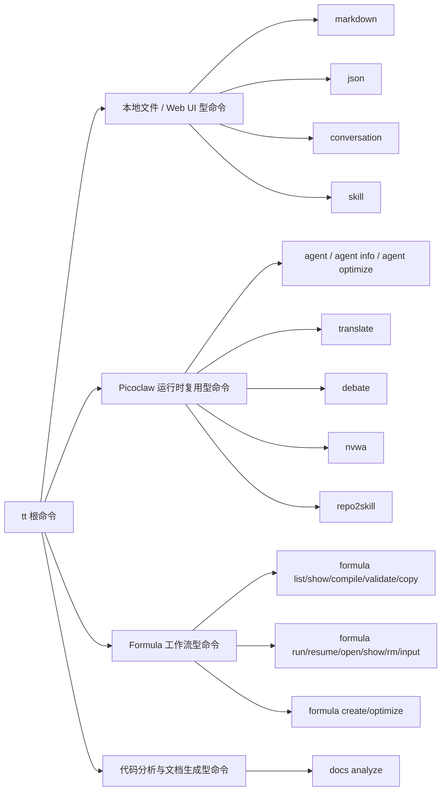
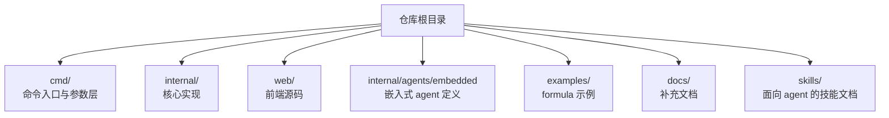

# 项目概览

> 最后更新：2026-06-05

## 这是什么

`tt` 是一个 Go 编写的集合式 CLI。它不是围绕单一业务打造的专用命令，而是把多类"本地开发辅助能力"统一放在同一根命令下：

- Markdown / JSON / conversation / skill 文件的本地浏览与编辑
- Picoclaw agent 运行时的嵌入式复用
- formula 模板的编译、实例化、执行与运行看板
- `cmd2skill`、`repo2skill`、`nvwa` 这类偏"生成式工程工具"能力
- 代码分析与文档生成（`tt docs analyze`）
- 若干项目配置与目录镜像工具

它的设计重点不是"大而全平台"，而是"把常用但分散的局部能力收拢成一个统一的开发者工作台"。

## 为什么这个项目值得拆开理解

这个仓库表面上看是普通 Cobra CLI，但实际包含多种非常不同的命令类型：

这张图最重要的意思不是"有哪些命令"，而是：**不同命令背后是完全不同的运行模型**。理解这一点后，很多实现上的分层就会变得自然。

## 项目主线

从源码看，`tt` 当前已经形成了比较清晰的主线：

1. 用 `cmd/` 承担统一 CLI 入口和参数编排。
2. 把复杂逻辑沉到 `internal/` 下的主题包中。
3. 对 Picoclaw 采用"嵌入式 runtime 适配层"，让多个命令共享模型、agent、skill、session 与配置。
4. 对 formula 采用"解析 → 解析继承/扩展 → 编译 typed Workflow → typed runtime 执行（含 preflight / workspace / env / human input / script repair）→ 保存运行状态 → Web Dashboard"的流水线。
5. 对本地内容浏览类能力，采用"Go 提供文件与 API，前端资源嵌入二进制"的模式。
6. 对代码分析能力，采用"嵌入式 docs-analyst agent"来动态生成理解导向的文档。
7. 对 agent 专业化能力，采用"嵌入式 agent-optimizer + code-context 探索"组合来为特定仓库产出优化版 agent。

## 技术栈与职责

| 技术 / 组件 | 作用 |
| --- | --- |
| Go 1.25 | 主体实现语言，承载 CLI、工作流、HTTP 服务与运行时整合 |
| Cobra | 根命令与子命令体系 |
| Picoclaw | agent 运行时、provider、agent loop、skills 生态（通过 `internal/picoclaw` 嵌入） |
| React / Vite | Markdown 与 Formula Dashboard 等 Web UI 前端 |
| Ant Design / React Flow / Mermaid | Formula Dashboard 的组件库、图编辑、图渲染 |
| `embed` | 把前端构建产物和嵌入式 agent 提示词打包进二进制 |
| fsnotify / nhooyr.io/websocket | markdown 等本地页面的热更新能力 |
| TOML / JSON | formula 定义格式与运行状态持久化格式 |
| BurntSushi/toml | formula 解析 |

## 目录层面的组织方式

这个项目的目录组织有一个很明显的特点：**对外暴露的是 CLI，对内真正的知识重心在 `internal/`**。如果只读 `cmd/`，只能知道"命令怎么接起来"，但很难理解"系统为什么这样工作"。

## 当前最值得优先理解的三个子系统

### 1. Formula 子系统
它已经不是简单模板替换，而是一个带有下列能力的小型工作流引擎：

- 变量校验与默认值（`vars` 段 + `--var key=value` 覆盖）
- 继承 / compose / expansion / advice
- compile-time 条件过滤
- runtime condition（支持 `==`、`!=`、`=~`）
- preflight 预检（`[preflight]`，含 command/exec/git/env/path 五种检查）
- loop body 与 until 条件（支持 parallel + max_concurrency）
- 多种 step kind：`agent` / `script` / `human_input` / `noop` / `aggregate` / `tool` / `write_files` / `loop` / `retry` 等
- step id 即输出 key + `input_context` 跨步引用
- environment context（`env.cwd` / `env.git.*` / `env.os.*`）
- workspace 策略（`worktree`，自动建分支、稀疏 checkout、cleanup）
- agent step 输出 schema 校验失败 → 自动 retry with advice
- script step 失败 → 用 `coder` agent 智能修复一次
- **StepFixer 自我修复抽象**（agent / script 走统一接口），`idempotent` 旗标按 kind 默认决定是否重试（agent 默认 true、script 默认 false），最多 3 次 attempt，attempt-aware advice 升级，修复报告 `RepairRecord` 落盘 `patches/<run-id>.json` 并通过 dashboard `Repairs` 面板 + 人工 `Confirm reviewed` 闭环
- 运行记录持久化与 Web Dashboard（`tt formula runs` / `tt formula run open`）
- 支持 resume（从中断处继续执行，含 step-id context 恢复）
- 支持 create/optimize（用嵌入式 `formula-writer` agent 生成和优化 formula）
- 动态 human input（`form = true`，让 agent 在缺信息时输出 `tt-human-input` 协议块）

### 2. Picoclaw 集成层
它让 `tt` 不必依赖单独调用外部 `picoclaw` 命令，而是在同一进程内完成：

- 配置路径解析
- runtime 加载
- provider 创建
- embedded agent 注入
- direct runner 调用
- 多命令共享 agent 生态

### 3. 代码分析与文档生成（新增）
`tt docs analyze` 是一个新增的命令，它：

- 使用嵌入式 `docs-analyst` agent 分析代码
- 可以分析本地目录或远程 GitHub 仓库
- 根据代码复杂度动态决定生成哪些文档
- 优先更新现有文档，而不是盲目替换
- 支持多张 Mermaid 图来解释架构、流程和模块关系

## 哪些能力是"基础设施型"，哪些是"产品型"

### 基础设施型
- `internal/picoclaw`
- `internal/formula`（语言与编译）
- `internal/formula/ast`（公式 AST）
- `internal/formula/ir`（typed Workflow IR）
- `internal/formula/steps`（Step 接口 + 各类 step 实现 + Registry）
- `internal/formula/runtime`（typed runtime 调度、ContextStore、StateStore、Capabilities、Environment、Worktree、Condition）
- `internal/formula/compile`（AST → IR 编译器）
- `internal/formula/builtin`（内置 formulas + atomics）
- `internal/formula/run`（运行记录持久化）
- `internal/formula/ui`（Dashboard UI DTO）
- `internal/formula/doc`（formula Markdown 渲染）
- `internal/formula/runview`（运行快照视图）
- `internal/ttconfig`
- `internal/webui`（前端嵌入 + 静态资源 handler）
- `internal/agents`（嵌入式 agent 注册）
- `internal/agentopt`（agent 优化引擎）

### 产品型 / 面向用户的命令能力
- `agent` / `agent optimize` / `agent info`
- `translate`
- `debate`
- `nvwa`
- `cmd2skill`
- `repo2skill`
- `markdown` / `json` / `conversation` / `skill`（本地 Web UI 命令）
- `mirror`
- `docs`（含 `docs analyze`，嵌入式 `docs-analyst` agent）
- `formula` 全部子命令（list/show/validate/compile/copy/create/optimize/run/runs/resume/input/show/rm/open）

## 适合谁阅读这个项目

- 想扩展一个多命令 Go CLI 的开发者
- 想在本地 CLI 中嵌入 agent runtime 的开发者
- 想实现"公式化工作流 + 执行状态保存 + Web Dashboard"的工程师
- 想把前端 UI 嵌入 Go 二进制的工具作者
- 想了解如何用 agent 自动生成理解导向文档的开发者

## 实现参考

- CLI 入口：`main.go`、`cmd/root.go`
- 项目定位与命令清单：`README.md`
- 依赖栈：`go.mod`
- 前端构建嵌入：`Makefile`、`internal/webui/*`
- docs 命令：`cmd/docs.go`、`internal/agents/embedded/docs-analyst.md`
- agent 优化命令：`cmd/agent_optimize.go`、`internal/agentopt/`、`internal/agents/embedded/agent-optimizer.md`
- formula 子包：`cmd/formula/`
- 内置 formula：`internal/formula/builtin/formulas/`、`internal/formula/builtin/atomics/`
- step kinds 实现：`internal/formula/steps/kinds.go`
- 运行环境与 worktree：`internal/formula/runtime/environment.go`、`internal/formula/runtime/workspace.go`