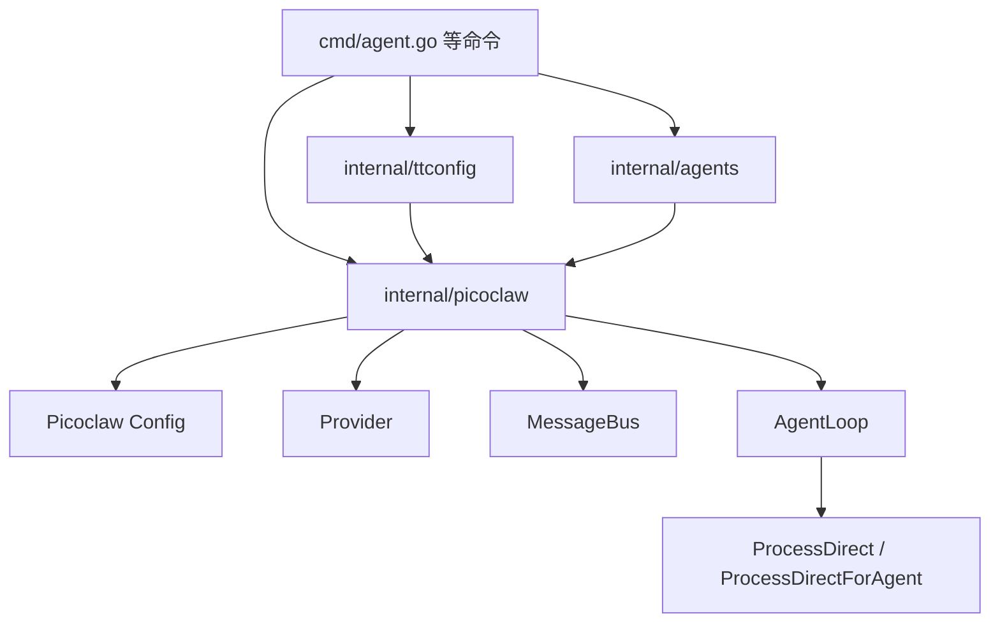
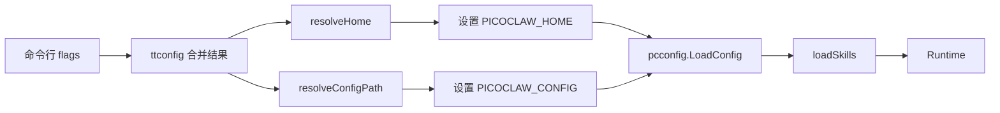
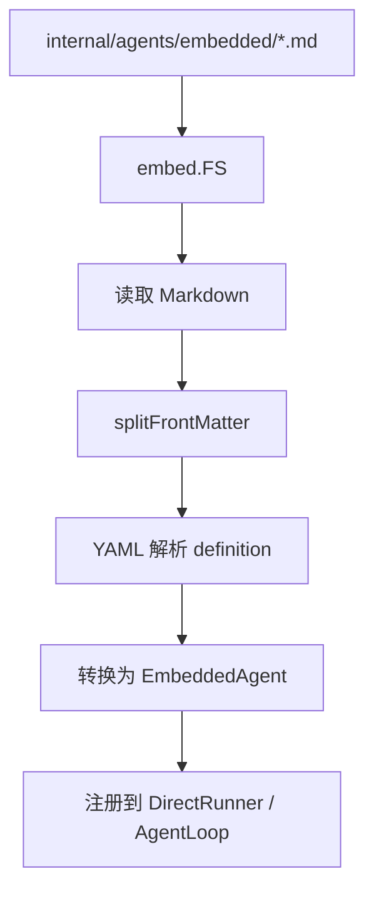
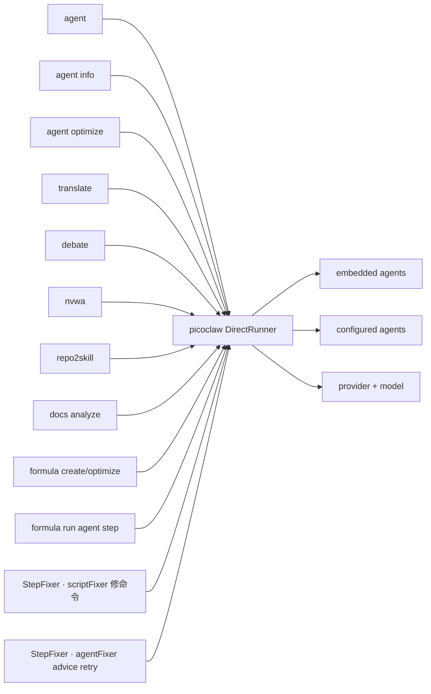

# Picoclaw 集成与嵌入式 Agent

> 最后更新：2026-06-05

`tt` 的很多高价值能力——`agent`、`agent info`、`agent optimize`、`translate`、`debate`、`nvwa`、`repo2skill`、`docs analyze`，甚至 `formula create/optimize/run` 与 `formula run` 内的 agent step ——本质上都依赖同一件事：**在当前进程内复用 Picoclaw runtime。**

这篇文档专门解释这一层，因为它是理解整个项目“为什么能持续长大而不散掉”的关键。

## 先看核心结论

`tt` 并没有自己重新发明一套 agent runtime，而是做了三件更有工程价值的事：

1. 包装 Picoclaw 的配置加载与 provider 创建。
2. 把 embedded agent 定义纳入当前仓库管理。
3. 提供统一的 `DirectRunner` 让多个命令共享同一套调用方式。

## 总体协作图



看这张图时要抓住一点：**`tt` 的命令层并不直接碰底层 provider，而是统一通过 `internal/picoclaw` 这个适配层。**

## Runtime 加载：`internal/picoclaw/runtime.go`

Runtime 的职责主要有四个：

1. 解析 Picoclaw home 目录
2. 解析 config 路径
3. 临时设置环境变量，再调用 Picoclaw 原生配置加载
4. 预加载 skills 列表，形成 runtime 摘要信息

## Runtime 解析链路



这张图解释的是：`tt` 并不是直接硬编码读取 `~/.picoclaw/config.json`，而是允许通过 `tt` 配置、环境变量和 flags 共同决定最终路径。

## 为什么要“临时设置环境变量再恢复”

源码里会在加载前保存原先环境变量，并在结束后恢复。这是一个很实用的工程细节：

- 能兼容 Picoclaw 现有配置加载逻辑
- 不会永久污染当前 shell 环境
- 多个命令在同一进程里工作时更安全

这类细节说明 `internal/picoclaw` 不是简单 wrapper，而是一个“兼容层”。

## DirectRunner：统一的同步调用接口

对上层命令来说，最常用的接口不是 Runtime 本身，而是 `DirectRunner`。

它负责：
- clone / 准备运行配置
- 绑定 workspace
- 注册 embedded agents
- 创建 provider / message bus / agent loop
- 同步处理 `ProcessDirect()` 请求
- 在关闭时清理 loop、bus 和 provider

## DirectRunner 工作流

```mermaid
sequenceDiagram
    participant Cmd as 命令层
    participant RT as Runtime
    participant DR as DirectRunner
    participant Loop as AgentLoop

    Cmd->>RT: NewDirectRunner(options)
    RT->>RT: ResolveRunOptions
    RT->>DR: 创建 provider / bus / loop
    RT->>DR: 注册 embedded agents
    Cmd->>DR: ProcessDirect(message)
    DR->>RT: ResolveRunOptions
    DR->>Loop: ProcessDirect / ProcessDirectForAgent
    Loop-->>DR: response
    DR-->>Cmd: normalized response
```

这张图说明：命令层看到的是一个很稳定的同步调用接口，而底层关于 provider、bus、loop 的复杂度都被包住了。

## embedded agent：为什么是 Markdown 文件

`internal/agents/embedded/*.md` 是这个项目非常有代表性的设计。

它把 agent 定义放在 Markdown 中，并配 YAML frontmatter，例如：
- `id`
- `name`
- `soul`
- `skills`
- `no_history`
- `enable_research_tools`

这样做的价值很直接：

1. agent 定义对人更可读。
2. prompt 与代码解耦，不必把大段提示词硬编码进 Go 文件。
3. 新增 agent 的成本更低，通常只要新增或调整 Markdown 定义。

## embedded agent 加载链路



这张图回答的是：仓库里的 agent 提示词文件是怎样真正进入运行时的。

## 当前内嵌 agent 生态

从 `internal/agents/agents.go` 和 `embedded/` 目录看，当前至少包括：

| Agent ID | 用途 | 触发命令 |
| --- | --- | --- |
| `coder` | 通用编码 / 修复 / 重构 / 调研 | `tt agent`、formula agent step 默认 agent |
| `full-stack` | 全栈视角实现 | `tt agent --agent full-stack` |
| `planner` | 任务分解与计划 | `tt agent --agent planner` |
| `product-manager` | 需求 / 验收条件 | `tt agent --agent product-manager` |
| `tester` | 测试设计与补齐 | `tt agent --agent tester` |
| `ui` | UI 实现与调整 | `tt agent --agent ui` |
| `reporter` | 报告 / 总结 | `tt agent --agent reporter` |
| `writer` | 长文写作 | `tt agent --agent writer` |
| `tech-blog-writer` | 科技博客风格写作 | `tt agent --agent tech-blog-writer` |
| `code-research` | 证据导向的代码研究 | `tt agent --agent code-research` |
| `translate-master` | 中英 / 多语种翻译 | `tt translate` |
| `repo2skill` | 把仓库分析成 skill | `tt repo2skill --analyzer agent` |
| `formula-writer` | 编写 / 优化 formula | `tt formula create` / `tt formula optimize` |
| `docs-analyst` | 代码理解与中文文档生成 | `tt docs analyze` |
| `agent-optimizer` | 把基础 agent 优化为针对仓库的 agent | `tt agent optimize` |
| `stock-growth-investor` / `stock-risk-investor` / `stock-discussion-host` | 股票讨论参与方 | `tt debate` |

这说明 embedded agent 已经不是少量 demo，而是一个真正被多个命令复用的内部能力库。

## 不同命令如何复用这套能力

### `tt agent`
最通用的入口，允许直接发送消息给某个 agent。可用 `--list` 列出已加载的 embedded agents 与 runtime 解析得到的 configured agents。

### `tt agent info`
以 JSON 输出已解析的 runtime 信息（home、config 路径、skills、agents、providers 摘要等）。

### `tt agent optimize`
用 `agent-optimizer` 把一个基础 agent 优化为针对目标仓库的专用 agent。优化后会写入 `internal/agents/embedded/*.md` 风格的新 Markdown 定义，默认就地更新源文件；`--copy` 创建副本，`--output` 显式指定路径。

### `tt translate`
使用固定的 `translate-master`。

### `tt debate`
一次运行里会使用多位 embedded stock agents 与主持/judge agent。

### `tt nvwa`
通过 `nvwa-prompt-designer` 生成角色 prompt。

### `tt repo2skill`
可用 `repo2skill` agent 分析仓库，缺模型或失败时回退到 `fallback_analyzer`。

### `tt docs analyze`
通过 `docs-analyst` agent 生成中文理解文档。

### `tt formula create/optimize`
通过 `formula-writer` agent 生成或优化 workflow 模板。

### `tt formula run`（agent step）
默认使用 `--agent` 指定或 `coder` agent；可在 step 上用 `agent.name` / `agent.model` 覆盖。

## 命令复用图



这张图最重要的理解是：**不同命令不是各自拥有独立的 agent 基础设施，而是复用一套共享运行模型。**

## 运行参数解析：为什么很多命令看起来相似

你会发现很多命令都支持这些参数：
- `--model`
- `--session`
- `--picoclaw-home`
- `--picoclaw-config`
- `--debug`

这不是重复设计，而是因为它们共享同一条运行时装配链。统一参数意味着：

- 用户体验更一致
- 代码路径更可复用
- 更容易把新命令接进这套运行时

## 与 `ttconfig` 的关系

Picoclaw 运行时并不是直接只读自身配置，还会受 `tt` 的双层配置影响：

- 全局 `~/.tt/config.json`
- 项目 `.tt/config.json`

在命令层，这些配置会先 merge，再传入 `internal/picoclaw.Load()`。

因此 `ttconfig` 实际上是 Picoclaw 在 `tt` 这个宿主 CLI 中的“前置配置层”。

## `formula run` 为什么也依赖 Picoclaw

很多人第一次看 formula 时容易以为它是完全独立子系统，但其实只有一部分是独立的：

- `internal/formula` 独立负责定义与编译
- `internal/formula/runtime` 与 `internal/formula/steps` 独立负责 typed runtime 执行语义
- 但 agent step 的真正执行，仍然依赖 Picoclaw DirectRunner

所以 formula 与 picoclaw 的关系可以概括为：

> formula 决定“做什么、按什么顺序做”，Picoclaw 决定“需要智能体时，如何真正调用模型和 agent”。

## 失败恢复与响应归一化

`DirectRunner.ProcessDirect()` 还承担了一些实用的健壮性逻辑，例如：
- 根据 agent 是否是默认 agent，选择 `ProcessDirect` 或 `ProcessDirectForAgent`
- 对 direct response 做 normalize
- 在空响应时尝试恢复

这类逻辑虽然不是“产品功能”，但对上层命令稳定性非常关键。

## 扩展一个新 agent 命令时应该怎么想

如果你要新增一个依赖 LLM/agent 的命令，通常可以沿着现有模式走：

1. 在 `cmd/` 新增命令文件
2. 读取并 merge `ttconfig`
3. 调用 `pcwrap.Load()`
4. 视情况准备 embedded agents
5. `NewDirectRunner()`
6. `ProcessDirect()`
7. 把结果渲染成终端输出或文件输出

这也是为什么 `tt` 能不断长新命令而不至于每个命令都复制一套底层逻辑。

## 读源码建议顺序

建议按下面顺序读：

1. `internal/picoclaw/runtime.go`
2. `internal/picoclaw/direct.go`
3. `internal/agents/agents.go`
4. `internal/agents/embedded/*.md`
5. `cmd/agent.go`
6. `cmd/translate.go`
7. `cmd/docs.go`
8. `cmd/debate.go`
9. `cmd/nvwa.go`

## 实现参考

- Runtime 加载：`internal/picoclaw/runtime.go`
- DirectRunner：`internal/picoclaw/direct.go`
- 运行参数解析：`internal/picoclaw/resolve.go`
- embedded agent 注册：`internal/picoclaw/embedded_agent.go`
- embedded agents 定义：`internal/agents/agents.go`、`internal/agents/embedded/*.md`
- 通用 agent 命令：`cmd/agent.go`
- 翻译命令：`cmd/translate.go`
- 文档分析命令：`cmd/docs.go`
- 讨论命令：`cmd/debate.go`
- formula 中的 agent 使用：`cmd/formula/` 与 `cmd/formula/formula_runtime.go`
