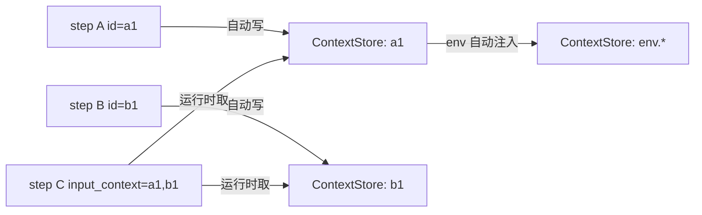

# Step Kinds 参考

> 最后更新：2026-06-28

> 补充：若关注“多个 formula 作为独立 run 顶层并发时，各类 step 的安全边界与 MVP 分层”，请结合阅读 [`docs/formula/step-safety-matrix-for-top-level-multi-run.md`](../docs/formula/step-safety-matrix-for-top-level-multi-run.md)。该文档按 step kind 区分了可直接并发、需隔离条件、建议限制、暂不纳入 MVP 的类别，并额外讨论了 `waiting_input`、repair、final report chat 等 run-scoped 行为为何不应被笼统视为并发安全。

本文档是 `tt formula` typed runtime 所有 step kind 的速查与示例参考。kind 枚举与默认值以 `internal/formula/steps/step.go` 和 `internal/formula/steps/kinds.go` 为准。

## 如何使用本文档

- 想新增某种 step → 在表格里找 kind，按示例写 TOML，把 `id` 设为稳定语义名。
- 想在 prompt 中拿到上游输出 → 用 `input_context = ["<upstream-id>"]`，参考 [数据流：step id 就是输出 key](./formula-system.md#数据流step-id-就是输出-key)。
- 想在执行前拦截 → 写 `[preflight]`；想在执行时过滤 → 用 `condition`；想在多分支中选一条 → 用 `gate`。
- 想做并发迭代 → 用 `loop` + `for_each` / `parallel` / `max_concurrency`。
- 想保留兼容性 → 优先用 `agent` / `script` / `human_input` / `noop`，它们在 `NewDefaultRegistry` 中默认注册；其它 kind 仅在自定义 registry 下可用。
- 想让 step **失败时自动修复** → 看 [自我修复](./formula-system.md#自我修复self-repair)：agent 默认 idempotent、script 必须显式写 `idempotent = true` 才会走 `StepFixer` 重试路径。
- 想让整个 Formula 被稳定复用 → 用顶层 `[outputs.<name>]` 声明公开结果；`vars` 是输入契约，调用方不应绑定内部 step ID。

## 通用字段

每个 step 都可声明（字段定义在 `internal/formula/types.go`，转译在 `internal/formula/ast/document.go`）：

| 字段 | 说明 |
| --- | --- |
| `id` | 稳定语义名；**也是默认输出上下文 key** |
| `title` | 展示名 |
| `description` / `description_file` | 写入 prompt 的提示，可使用 `{{var}}` / `{{step-id.field}}` 模板 |
| `type` | 当 `execution` 未设时使用；与 `execution` 等价 |
| `depends_on` | 字符串数组，前置步骤 id |
| `needs` / `waits_for` | 额外数据/事件依赖 |
| `condition` | 表达式，runtime 评估；为 false 时该 step 被跳过（仍计入 run） |
| `validate` | 输出 schema 校验；失败时对 agent step 会自动 advice retry 一次 |
| `idempotent` | 布尔（typed schema: `StepDecl.Idempotent`；recipe TOML: 顶层 `idempotent = true`）；决定失败时是否能被 `StepFixer` 重新执行。`agent` / `external_agent` 默认可重试；`script` 默认**非幂等**，必须显式写 `idempotent = true` 才走自修路径 |
| `output_key` | 可选覆盖默认输出 key；新公式不要写 |
| `execution` | `agent` / `script` / `human_input` / `formula` / `aggregate` / `tool` / `write_files` / `noop` |

`kind` 枚举的权威来源是 `internal/formula/steps/step.go` 的常量块。`NewDefaultRegistry()` 默认注册 `Noop` / `Agent` / `Script` / `HumanInput` / `Loop` / `Retry` / `ExternalAgent` / `FormulaCall`。其它 kind（`condition` / `gate` / `embed` / `expand` / `tool` / `aggregate` / `write_files`）通常由 recipe 编译链路转成 typed step，或由专用子命令消费。

## 13 种 Step Kind

### `agent` —— agent 推理步骤

调用 Picoclaw 复用 runtime 执行一次 agent；这是大多数自动化能力的核心。

```toml
[[steps]]
id = "research-bug"
title = "调研 bug 是否真实存在"
execution = "agent"

[steps.agent]
name = "coder"          # 可选；缺省 --agent 或 "coder"
model = ""              # 可选；缺省使用 provider 默认
prompt = """
基于 {{issue_summary}} 调研 {{repo}}。
读相关代码并形成结论 JSON。
"""
input_context = ["fetch-pr", "review-risk"]
dynamic_form = false    # true 时允许 agent 在输出中夹带 tt-human-input 块
cwd = "{{env.git.root}}"
output_key = ""         # 推荐留空，使用 id 作为输出 key

[steps.validate]
required = ["conclusion"]
types = { conclusion = "string" }
```

要点：

- 实际 prompt 会被追加 `Formula step execution guard`，明确告诉 agent"必须真的完成任务，不要复述规则"。
- `input_context` 中的每个 key 会被附加为"## Input context"段到 prompt 末尾。
- `dynamic_form = true` 时，agent 若输出包含 `tt-human-input` 的 fenced 块，会被解析为 `AwaitRequest`，step 状态变 `waiting_input`，run 进入暂停。
- `cwd` 为空时回退到 `env.workspace_cwd`，再回退到 `env.invocation_cwd`。
- **自我修复**：`agent` 默认 `idempotent = true`，失败或 `validate` 校验失败时走 `StepFixer` 抽象里的 `agentFixer` 重试，**最多 3 次 attempt**。每次 attempt 的 advice 会升级：
  - `attempt = 1` —— 基础 validation feedback
  - `attempt >= 2` —— 追加 required JSON shape + self-check
  - `attempt >= 3` —— 进一步收紧到 "只输出一个紧凑 JSON 值"
- 修复过程会写 `RepairRecord`（含 `Advice` / `FormulaUpdateHint` / `NextAttemptHint`）到 `patches/<run-id>.json`，dashboard `Repairs` 面板可见。
- 如果想关闭自动重试（比如在跑大模型时希望一次失败就停），显式写 `idempotent = false`。

### `script` —— 确定性脚本步骤

调用 `exec.CommandContext` 执行 `argv` 形式命令，并通过 `Capabilities.Scripts` 暴露给 runtime。

```toml
[[steps]]
id = "git-status"
title = "采集 git 状态"
execution = "script"

[steps.script]
command = ["bash", "-lc", "git status --porcelain=v1 -b --branch"]
format = "text"          # text | json | raw
timeout = "10s"
cwd = ""
env = { MY_VAR = "{{issue_summary}}" }
```

要点：

- **安全策略**（`internal/formula/runtime/capabilities.go` 中 `ValidateScriptCommand`）：
  - 拒绝 `argv[0]` 在 `rm` / `rmdir` / `mkfs` / `dd` / `shutdown` / `reboot` / `halt` / `poweroff` / `sudo` / `su` / `chmod` / `chown` 中的命令。
  - 拒绝连接后的字符串包含 `rm -rf` / `:{()` / `> /dev/` / `mkfs.` / `curl | sh` / `wget | sh` 模式。
  - 这条策略在 `--allow-shell-script` 之外总是生效；若确实需要 `rm`，请用 `git worktree remove` / 显式 move 到 `.tt/tmp/`。
- 默认注入环境变量：`TT_INVOCATION_CWD` / `TT_WORKSPACE_CWD` / `TT_FORMULA_RUN_DIR`。
- `format` 影响 output value 的 `Type` 字段（影响后续 `aggregate` / `condition` 的 JSON 解析）。
- **自我修复**（`scriptFixer`）：script step 默认 `idempotent = false`，失败时 runtime **不会自动重试**，而是直接终止。要让 runtime 走 `StepFixer` 自动修命令 + 重跑，必须显式写：

  ```toml
  [[steps]]
  id = "fetch-pr"
  title = "Fetch PR metadata"
  execution = "script"
  idempotent = true   # ← 显式声明可重试；script 默认 false
  ```

  修复最多 3 次 attempt，每次 attempt 都会生成 `RepairRecord`（含 `OriginalCommand` / `FixedCommand` / `NextAttemptHint`），落盘到 `patches/<run-id>.json`，推到 dashboard `Repairs` 面板。runtime 不会替作者 patch formula —— `FormulaUpdateHint` 仅作为建议，等用户 `Confirm reviewed` 后再用 `tt formula create` / `optimize` 改回源文件。

### `human_input` —— 静态澄清表单

提供一组确定字段让用户填写（CLI 表格 / Dashboard 表单）。

```toml
[[steps]]
id = "clarify-scope"
title = "澄清研究范围"
form = true              # 顶层 form 旗标 = 启用 human_input

[steps.form]
title = "请补充背景信息"
fields = [
  { key = "scope", label = "研究范围", type = "textarea", required = true },
  { key = "audience", label = "目标读者", type = "select", options = ["工程师","PM","研究"], default = "工程师" }
]
```

要点：

- 静态 form 适合字段稳定、采集成本低的场景。**对不稳定的字段推荐用 `agent` step + `dynamic_form = true`**，由 agent 自行决定是否问、问什么。
- 字段类型支持 `text` / `textarea` / `select` / `multiselect` / `checkbox` / `number` 等。
- 运行时 form 在 `WaitingInput` 状态下被恢复；`tt formula run input <run-id> --key k1=v1 --key k2=v2` 提交。

### `noop` —— 占位步骤

```toml
[[steps]]
id = "manual-checkpoint"
execution = "noop"
title = "等待外部操作"
description = "运营同学手动确认后由 operator 用 formula run input 注入标记"
```

要点：直接返回 `completed`，不调用任何能力。常用于占位 / 显式分隔 / 后续手动 step。

### `formula` —— 运行时复合步骤

把另一个 Formula 当作一个普通 step 执行。父 Formula 只绑定子 Formula 的公开 `vars`，并只接收其公开 `outputs`：

```toml
[[steps]]
id = "implementation"
title = "执行实现流程"
execution = "formula"
formula = "coding-implementation"

[steps.with]
requirement = "{{requirement}}"      # 完整模板会保留对象/数组等 JSON 类型
project_context = "repo={{env.git.repo}}"
```

要点：

- `[steps.with]` 是显式输入映射；完整的 `{{context.path}}` 会保留原始 JSON 类型，混合文本模板会得到字符串。
- step 直接返回子 Formula 的公开 outputs map，不再额外包一层特殊 JSON；可用 `implementation.<output-name>` 访问。
- `report` 是约定的人类可读 Markdown 主输出。若子 Formula 有顶层 `final-report` 且没有显式声明，编译器会自动生成 `outputs.report`。
- 子步骤状态写入父 run 的 StateStore，地址形如 `implementation.formula(coding-implementation).plan`。
- 子 Formula 的 waiting、失败和取消会传播到 FormulaCall；恢复父 run 时，已经完成的子步骤会从同一状态存储中恢复。
- Formula Web 在 Step runs、Execution timeline 与 Live runs graph 中展示这条调用层级；概览 graph 的 FormulaCall 节点聚合所有子运行状态。
- 嵌套 `human_input` 的请求携带真实子步骤地址，输入不会误提交到 FormulaCall 父节点。
- runtime 会拒绝直接或间接递归 Formula 调用，并限制最大嵌套深度。

### `loop` —— 嵌套 typed 步骤

支持固定次数或 `for_each` 数组式并发迭代。

```toml
[[steps]]
id = "review-files"
title = "并发生成每篇审阅意见"
execution = "loop"

[steps.loop]
for_each = "fetch-pr-files"   # 上游 step id 必须是 JSON 数组
var = "file"                   # 每次迭代把元素绑到这个变量名
parallel = true
max_concurrency = 4
until = ""                     # 可选；非空时若 body 输出匹配就 break
max = 0                        # 固定次数模式（for_each 缺省时使用）

  [[steps.loop.body]]
  id = "comment"
  execution = "agent"
  [steps.loop.body.agent]
  name = "coder"
  prompt = "针对文件 {{file.path}} 给出 review 建议"
  input_context = ["file"]
```

要点：

- `for_each` 模式下，runtime 会把数组中每个元素独立克隆一份 `ContextStore` 副本并绑定 `var`，body 内 step 通过 `input_context = ["file"]` 拿到当前元素。
- `parallel = true` + `max_concurrency > 0` 时使用 goroutine pool；最终聚合每个迭代结果到 `<loop.id>.iterations`。
- `max` 模式（无 `for_each`）把当前迭代号写到 context 的 `iteration` 键，body 可读。

### `retry` —— 嵌套尝试

```toml
[[steps]]
id = "fetch-with-retry"
execution = "retry"

[steps.retry]
max_attempts = 3
on_exhausted = "fail"          # fail | ignore

  [[steps.retry.body]]
  id = "fetch"
  execution = "script"
  [steps.retry.body.script]
  command = ["curl", "-fsSL", "{{url}}"]
```

要点：内部失败的 child 会被重跑；`on_exhausted` 控制耗尽后整体是失败还是忽略。

### `aggregate` —— 数据投影

从已有 step 输出中抽 JSON 数组，做字段筛选/重命名/包壳。

```toml
[[steps]]
id = "pr-summary"
execution = "aggregate"

[steps.aggregate]
source = "fetch-pr-files"      # 必须是 JSON 数组
as = "files"                    # 输出为 {"files":[...]} 而不是裸数组
require = ["path"]              # 过滤：必须包含这些 key
include = ["path", "additions", "deletions"]
exclude = ["raw_url"]
flatten = false                 # true 且结果只有 1 个元素时取首个
```

要点：

- `source` 必须是 JSON 数组；若上游输出是字符串，runtime 会尝试从 fenced JSON 块解析。
- `include` 留空表示保留全部 key，再由 `exclude` 减除。

### `write_files` —— 把数据落盘为文件

```toml
[[steps]]
id = "write-report"
execution = "write_files"

[steps.write_files]
source = "render-report"         # 上游 step 输出
root = "docs"                    # 相对 repo 根
dir_name = "{{topic_slug}}"      # 子目录
filename_key = "title"           # 用对象内哪个 key 当文件名
title_key = "title"
summary_key = "summary"
content_key = "content"          # markdown 内容
```

要点：

- 文件名会用 `safeMarkdownFilename` 过滤，不安全字符会被替换。
- 输出结构稳定，dashboard / subsequent steps 可直接读 `write_report.files`。

### `tool` —— 内建确定性工具

`tool` 是一个"分发器"，按 `name` 把执行路由到下层子步骤，常见用途是替代 shell：

```toml
[[steps]]
id = "do-sleep"
execution = "tool"

[steps.tool]
name = "sleep"
[steps.tool.sleep]
duration = "2s"

[[steps]]
id = "checkout"
execution = "tool"

[steps.tool]
name = "git_checkout"
[steps.tool.git_checkout]
branch = "feature/cool"
create = true
```

支持的 `name`（参见 `kinds.go` 中 `ToolStep.Run` 的 switch）：

- `write_files` —— 同上
- `sleep` —— 暂停 `duration`（`time.ParseDuration` 格式）
- `git_fetch` / `git_push` / `git_branch` / `git_checkout` / `git_worktree` —— 确定性封装 `git` 命令

### `condition` / `gate`

这两个 kind 仅有 `kind` 常量与配套类型，没有注册到 `NewDefaultRegistry`，通常在自定义 `compile.Compiler` 中使用：

- `condition`：仅声明一个表达式，效果与 step 的 `condition` 字段类似。
- `gate`：阻塞到所有 `dependencies` 表达式的条件都为真才放行。

实现自定义 step 时直接实现 `steps.Step` / `steps.Executable` 接口并通过 `Registry` 注入即可。

### `embed` / `expand`

- `embed` —— 在公式中引用其它 formula 的 steps，相当于 inline include；要求被嵌入 formula 公开。
- `expand` —— 在 `template` 段中按条件生成 steps；`expand_vars` 控制哪些变量被注入新步骤。

二者都仅在解析/编译阶段生效，runtime 不再识别为独立 step kind。

## 上下文模板与条件

### `{{var}}` 模板

在 `description` / `prompt` / `cwd` / `command` 数组元素 / `env` 值中可用：

- `{{var.foo}}` —— `[vars]` 段声明的 `foo`
- `{{step-id}}` —— 整个 step 输出（被 `valueForPrompt` 序列化为 JSON 或文本）
- `{{step-id.path.to.field}}` —— 嵌套字段
- `{{env.git.branch}}` —— `env` 注入的环境信息

模板渲染失败会保留原文并继续执行，不要假设一定解析成功。

### `condition` 表达式

`condition` 用一个小表达式 DSL，由 `stepConditionMatches` 求值：

```text
key1.subkey == "frontend"
count >= 3
status =~ "^ok$"
```

- 操作符：`==` / `!=` / `=~`（正则）
- 值会从 context 取，数字 / 字符串自动转换；空 / 缺失视作 `"nil"`。

## 输出键与上下文流转



`ContextStore` 会在 `set` 之前自动注入 `env` 键：

```text
env.cwd
env.invocation_cwd
env.workspace_cwd
env.formula_run_dir
env.os.name
env.os.arch
env.git.is_repo
env.git.root
env.git.repo
env.git.branch
env.git.commit
env.git.remote_url
```

所有 step 在写入输出前都会先把 `env` 注入完毕。详见 [Formula 工作流系统](./formula-system.md#数据流step-id-就是输出-key)。

## 常见陷阱

1. **id 与 output_key 同时写**：旧公式中两个键都设了会导致"双写入"；新公式仅用 id。
2. **把 `dynamic_form` 写在顶层 `form` 而不是 `agent.dynamic_form`**：这两者意义不同；`form = true` 是启用静态 `HumanInput` step，`agent.dynamic_form = true` 是允许 agent 临时发起澄清。
3. **把危险命令塞到 `script.command`**：会触发安全策略拒绝；改用 `tool.git_*` 或走 `tool.write_files`。
4. **依赖 `for_each` 数组但上游输出是字符串**：runtime 会尝试 fenced JSON 解析，但只在 fenced 块中能找到。最好让上游 `script` 显式 `format = "json"` 并直接输出 JSON。
5. **写 `condition` 时用未加引号的字符串值**：表达式里所有字符串都应加引号，如 `kind == "frontend"`。
6. **在 `human_input` 静态 form 里塞复杂条件**：超出稳定字段时，改用 `agent` + `dynamic_form`。

## 调试 / 观察

- 每次 step 的 `prompt` / `output` / `error` 都会写到 `~/.local/share/tt/formularuns/<run-id>/steps/<node-id>.*`。
- run store 的 `state.json` 包含每个 node 的 `status` / `attempts` / `lastError` / `outputKey`，dashboard 通过 `formula/ui.Snapshot` 读取。
- `--dry-run` 会用 `DryRunAgentCapability` / `DryRunScriptCapability` 替代真实执行，只打印请求不调用 LLM / 进程。
