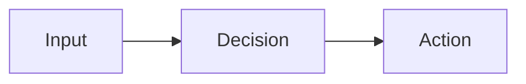
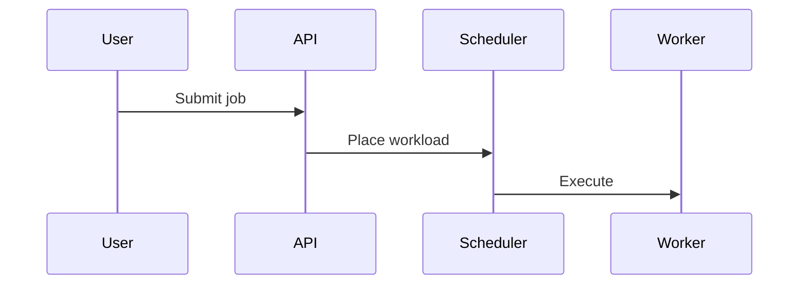

# Slide Writer

Use this skill to author `.slide` documents for `tt slide`.

Reference docs:

- [tt slide semantic spec](tt-md:ai-docs/slide.md)
- [Slide template writer skill](tt-md:skills/slide-template-writer/SKILL.md)

The source of truth is the `.slide` document format. A `.slide` deck defines presentation content and semantic structure only. It must not depend on any specific template, brand, color palette, font, logo, CSS class, or visual implementation. Templates beautify the same semantic deck at runtime.

## Core rule

Write a `.slide` so that another template can render it correctly without changing the document.

`tt slide` presents content on a fixed `1600px × 900px` 16:9 canvas that is uniformly scaled for normal windows, fullscreen, and different screen sizes. Do not compensate for screen size in the `.slide` document. If content feels crowded on that canvas, split it into more slides instead of adding template-specific layout tricks or shrinking text.

Do:

- Use Markdown for content.
- Use `---` to separate slides.
- Use semantic slide directives such as `.center`, `.cover`, `.split`, `.two-column`, `.brand`, `.end`, `.full-bleed`, `.absolute`, and `.no-panzoom` when they match the slide's job.
- Use Mermaid / D2 fenced code blocks for diagrams.
- Keep content concise and presentation-ready.

Do not:

- Add `template:` to front matter.
- Mention template names as required document syntax.
- Depend on any template-specific behavior.
- Write raw template CSS classes or template-specific HTML for layout. Raw HTML is acceptable only for supported `.slide` authoring controls such as Reveal fragments, section attributes, `.absolute` freeform positioning, and `.media-box` sizing.
- Use brand-specific copy, logo placeholders, colors, or visual instructions unless the user explicitly asked for that content as part of the message.

## File basics

- Deck files must use the `.slide` extension.
- `tt slide` only scans and opens `.slide` files.
- Start a deck with `tt slide path/to/deck.slide`.
- Slides are separated by a line containing only `---`.
- Styling is intentionally outside the `.slide` document. The document only records content and semantic structure.

## Optional front matter

A deck may start with front matter:

```markdown
---
title: Quarterly Platform Review
transition: fade
---
```

Allowed document-level fields:

- `title:` browser/window title metadata.
- `transition:` generic Reveal transition hint.
- `layout:` generic default layout hint, used sparingly.

Do not use `template:`. Template selection is outside the `.slide` document.

## Slide separators

Each slide begins after `---`:

```markdown
# First slide

One clear message.

---

# Second slide

- Point A
- Point B
```

Do not use horizontal rules for decoration inside a slide, because `---` is the slide separator.

## Supported semantic directives

A directive appears at the top of a slide and is not rendered as visible content.

| Directive | Meaning |
| --- | --- |
| `.cover` | This slide is a cover/title page |
| `.center` | Center one important message |
| `.split` | Two-part slide, usually concept plus evidence, text plus diagram, or before plus after |
| `.two-column` / `.columns` | Balanced two-column content |
| `.three-column` / `.three-columns` | Three short parallel columns; use for three peer ideas, options, phases, or examples |
| `.four-column` / `.four-columns` | Four very short parallel columns; use for compact steps, labels, dimensions, or comparisons |
| `.grid` | Repeating item layout for 3 to 6 comparable blocks |
| `.cards` | Card-based layout for features, capabilities, risks, or options |
| `.flex` | Flexible wrapping layout for mixed short blocks |
| `.hero` | Large message plus supporting visual or details |
| `.media-left` / `.media-right` | Text plus image/diagram/media, with media side indicated |
| `.brand` / `.logo` | Brand/identity page semantics; template decides presentation |
| `.full-bleed` / `.bleed` | Remove slide padding and let one media item cover the full 1600×900 stage; use for immersive image/video/iframe/canvas/svg pages |
| `.no-padding` | Remove slide padding while preserving full media with `object-fit: contain`; use for screenshots, diagrams, and design references that must not be cropped |
| `.absolute` / `.freeform` | Freeform composition page; remove padding and position elements anywhere with `.abs`, `.abs-center`, or `.abs-fill` CSS-variable controls |
| `.no-panzoom` / `.no-zoom` / `.no-drag` / `.static-diagram` | Make Mermaid/D2 diagrams static by disabling toolbar, wheel zoom, and drag pan on this slide |
| `.end` / `.closing` / `.final` | Closing/end page semantics; template decides presentation |

Prefer `.end` for a final closing page because it is short and template-agnostic.

## Per-slide visual planning

Before writing each slide, decide its visual role. Do not simply place a title and a few bullets in the top-left corner. A good `.slide` document gives the template enough semantic structure to make every page feel intentionally composed.

For every slide, choose one of these patterns:

| Content situation | Recommended structure | Why |
| --- | --- | --- |
| One strong message, little text | `.center` | Prevents sparse top-left pages; lets template center and enlarge the message. |
| Two comparable ideas | `.two-column` with one `:::columns` block per side | Fills horizontal space and creates balance. |
| Three peer ideas, stages, or options | `.three-column` with three `:::columns` blocks | Shows parallel structure without card chrome; each column must be short. |
| Four compact labels, steps, or dimensions | `.four-column` with four `:::columns` blocks | Fits compact comparisons; avoid long bullets or paragraphs. |
| 3 to 6 peer items | `.grid` with `:::item` blocks | Gives each item equal visual weight. |
| Feature / option / risk cards | `.cards` with `:::card` blocks | Lets templates add card surfaces and spacing. |
| Short mixed blocks | `.flex` with normal Markdown or `:::item` blocks | Allows stable wrapping inside the fixed canvas. |
| Big message plus proof | `.hero` | Emphasizes one main statement without top-left sparsity. |
| Full-screen image/video/visual | `.full-bleed` or `.no-padding` | Gives media the whole stage; choose cover for atmosphere, contain for exact screenshots. |
| Precise overlay, callouts, or poster-like composition | `.absolute` / `.freeform` plus `.abs` blocks | Allows deliberate placement on the fixed 1600×900 canvas without editing template CSS. |
| Text plus image/media | `.media-left` / `.media-right` with `:::media` and `:::main` | Keeps media and explanation balanced. |
| Text plus diagram / evidence | `.split` or `.two-column` | Avoids squeezing diagram under text. |
| Main diagram / architecture / flow | Short title plus Mermaid/D2 only | Lets renderer treat it as diagram-heavy and use most of the slide. |
| Dense notes | Split into several slides | Prevents tiny text and visual clutter. |
| Closing / thank-you | `.end` | Leaves visual rendering to the template. |

Rules:

- If a slide has fewer than 2 bullets or less than ~120 characters, use `.center` unless it is a cover, diagram, or closing page.
- If a slide has a diagram, keep surrounding text very short: title plus one sentence at most.
- If a slide is primarily one image, video, screenshot, design frame, or iframe, use `.full-bleed` when cropping is acceptable and atmospheric, or `.no-padding` when the entire media must remain visible.
- If the slide needs exact overlays, labels, badges, callouts, or a poster-like composition, use `.absolute` / `.freeform` with `.abs` and CSS variables rather than inventing template CSS.
- Do not put a large diagram below a long bullet list. Split it into “message” and “diagram” slides, or use `.split`.
- Before finalizing a slide, do a boundary check for the fixed 1600×900 canvas: title, body, diagram, media, and margins must plausibly fit without clipping or overflowing.
- If content may exceed the slide boundary, reduce text, split into more slides, choose a less dense layout, move detail to notes/appendix, or resize/reposition media. Do not solve overflow by relying on tiny text.
- Prefer 3 to 5 visually balanced blocks over one short lonely paragraph.
- For lists, keep bullets parallel and similar length so the template can distribute them cleanly.
- When converting notes, plan the deck as pages first, then write content. Do not preserve the note order if it creates awkward sparse pages.

## Columns syntax

For two-, three-, or four-column content, use one `:::columns` block per column and choose the matching directive: `.two-column`, `.three-column`, or `.four-column`.

```markdown
---

.two-column

# Compare operating models

:::columns
## Current

- Manual capacity planning
- Long queue times
- Fragmented utilization
:::

:::columns
## Target

- Elastic pools
- Predictable throughput
- Shared utilization
:::
```

Keep columns roughly balanced. Three-column and four-column slides have less horizontal room, so each column should usually contain a short heading plus 1 to 3 short bullets or one short sentence. If one side is much longer, split the slide.

Use one `:::columns ... :::` block for each column. Do not use ad-hoc separators for columns.

## Rich layout blocks

For richer layouts, use semantic block fences. These are `tt slide` document semantics, not template-specific CSS. Templates decide the exact visual treatment.

Cards:

```markdown
---

.cards

# Runtime building blocks

:::card
## Local UI
- Markdown
- Slide
- JSON
:::

:::card
## Agent runtime
- Embedded agents
- Skills
- Tool access
:::
```

Grid items:

```markdown
---

.grid

# Integration points

:::item
## cmd/
CLI entrypoints
:::

:::item
## internal/
Domain logic
:::
```

Media layout:

```markdown
---

.media-right

:::main
# Local-first presentation

- Fixed 16:9 canvas
- Relative assets
- Template-owned styling
:::

:::media

:::
```

Available block roles: `:::columns`, `:::card`, `:::item`, `:::main`, `:::aside`, and `:::media`.

## Freeform and media controls

Use these controls when semantic blocks are not enough, for example poster-like layouts, full-screen visuals, product screenshots, callouts, or precise overlays. They are supported `.slide` syntax, not template-specific CSS.

### Full-screen media

Use `.full-bleed` / `.bleed` when the media may be cropped to fill the 16:9 stage. Use `.no-padding` when the whole image or screenshot must remain visible.

```markdown
---

.full-bleed


```

```markdown
---

.no-padding


```

### Absolute positioning

Use `.absolute` / `.freeform` only when the slide needs deliberate placement. The stage is `1600px × 900px`; use CSS variables for placement.

````markdown
---

.absolute

<div class="abs" style="--x:96px; --y:80px; --w:720px; --z:2">
  <h1>Core decision</h1>
  <p>One clear message for the audience.</p>
</div>

<div class="abs media-box media-cover" style="--x:900px; --y:0; --w:700px; --h:900px">
  
</div>
````

Positioning classes:

- `.abs`: exact placement with `--x`, `--y`, `--right`, `--bottom`, `--w`, `--h`.
- `.abs-center`: centered by default; override center point with `--x` and `--y`.
- `.abs-fill`: fills the slide; use `--inset` for margins.
- Optional variables: `--z`, `--rotate`, `--scale`, `--tx`, `--ty`, `--origin`.

### Media sizing

Use `.media-box` around media when size, crop mode, aspect ratio, or radius matters.

```html
<div class="media-box media-contain" style="--w:980px; --h:560px; --radius:18px">
  
</div>
```

Media classes:

- `.media-cover`: crop to fill.
- `.media-contain`: preserve full media.
- `.media-fill` / `.media-stretch`: stretch to fill.
- `.media-none`: original sizing.
- `.media-16x9`, `.media-4x3`, `.media-1x1`: quick aspect ratios.

Rules:

- Prefer semantic layouts first. Use `.absolute` when exact composition is the point.
- Do not use freeform positioning to squeeze too much text into one slide.
- Keep inline styles limited to supported CSS variables like `--x`, `--y`, `--w`, `--h`, `--fit`, and `--radius`.

Guidelines:

- Use semantic layout directives before adding raw HTML. Raw HTML should be rare.
- Do not write inline CSS such as `style="display:grid"`; use `.grid`, `.cards`, `.flex`, `.hero`, or `.media-*` and let templates render them.
- Keep block fences flat. Do not nest `:::card` inside `:::columns` unless the parser explicitly supports that in the future.
- For `.grid` / `.cards`, prefer 3 to 6 blocks. If you need more, split into multiple slides.
- For `.media-left` / `.media-right`, put explanatory text in `:::main` and the image/SVG/video/diagram in `:::media`.
- For `.hero`, use one large takeaway plus one supporting block; avoid turning it into a dense two-column slide.

## Reveal timing and advanced motion

`tt slide` renders through Reveal.js. Use Reveal timing features only when they improve the presentation rhythm. Do not use them as a substitute for clean slide structure.

### Page transitions

- Prefer template-level transition defaults in `template.json`, for example `defaults.transition = "fade"`.
- Avoid per-slide `data-transition` unless one page needs a special emphasis.
- If needed, raw HTML `<section data-transition="zoom">...</section>` can express a Reveal-specific page transition, but this makes the slide less template-neutral.

### Fragments inside a slide

Use fragments for step-by-step teaching, staged reveals, and progressive emphasis. Raw HTML is acceptable for small local fragments:

```html
<ul>
  <li class="fragment" data-fragment-index="1">Establish the current state</li>
  <li class="fragment" data-fragment-index="2">Reveal the bottleneck</li>
  <li class="fragment highlight-green" data-fragment-index="3">Show the resolution</li>
</ul>
```

Useful Reveal classes:

- `fragment`: appear at a fragment step.
- `current-visible`: visible only while current.
- `highlight-red`, `highlight-green`, `highlight-blue`: highlight during a step.
- `fade-in`, `fade-out`: explicit entry/exit behavior.

Rules:

- Use fragments sparingly, usually 2 to 5 staged items on a slide.
- Add `data-fragment-index` when order matters.
- Do not fragment every bullet in ordinary business slides.
- If the only goal is visual polish, use semantic layout directives and let the template style the page.

### Auto-animate between slides

Use `data-auto-animate` when adjacent slides show the same object changing state, such as a pipeline gaining one stage or an architecture evolving.

```html
<section data-auto-animate>

# Current path

<div data-id="pipeline">User → API → Worker</div>

</section>

---

<section data-auto-animate>

# Add scheduling

<div data-id="pipeline">User → API → Scheduler → Worker</div>

</section>
```

Guidelines:

- Put `data-auto-animate` on both adjacent slides.
- Give moving conceptual objects stable `data-id` values.
- Animate one conceptual change at a time.
- Prefer normal slide transitions for ordinary page changes.

### CSS and JS boundaries

- Template CSS may style `.fragment.visible`, `.current-fragment`, or custom fragment classes.
- JS event hooks such as `slidechanged`, `fragmentshown`, and `fragmenthidden` belong in the player/template layer, not ordinary `.slide` prose.
- Use JS only for advanced linked behavior like SVG animation, video control, or chart state changes.

## Diagrams

Use fenced code blocks for diagrams. The document should describe the diagram semantically, not prescribe template styling.

Diagram slides should usually be almost all diagram. Use a short takeaway title, optionally one short subtitle, then the Mermaid/D2 block. The renderer marks diagram-heavy slides so templates can expand diagrams toward full-slide size.

During presentation, Mermaid and D2 diagrams are fit inside the slide by default. Viewers can use the diagram toolbar or mouse wheel to zoom, drag to pan, and double-click / Reset to return to the full-fit view. Because of this, prefer one meaningful diagram per slide instead of multiple small diagrams.

If a diagram should be purely static, or the user asks to disable zooming, dragging, panning, or accidental interaction, add `.no-panzoom`, `.no-zoom`, `.no-drag`, or `.static-diagram` at the top of that slide.

````markdown
---

.no-panzoom

# Static process map


````

Avoid:

- Long bullet lists before a diagram.
- Multiple unrelated diagrams on one slide.
- Tiny diagrams that should be expanded into a process, architecture, or sequence slide.

Mermaid:

````markdown
---

# Request lifecycle


````

D2:

````markdown
---

# System boundaries

```d2
api -> scheduler -> worker
scheduler -> database
```
````

## Tables

Use tables only when the audience needs side-by-side comparison. Tables must stay readable on a fixed `1600px × 900px` canvas.

Rules:

- Prefer 3 to 5 columns and 3 to 6 body rows.
- Keep cell text short; use phrases, not paragraphs.
- If a table needs many rows, split it into multiple slides or summarize the key rows.
- Do not compensate for dense tables by asking the template to use tiny fonts.

## Images and links

Use standard Markdown image and link syntax. For local deck-owned media assets, put files next to the deck, usually in an `assets/` directory, and use relative paths. For local Markdown documents that should open in the tt reader, use `tt-md:` links:

```markdown

[Design note](tt-md:docs/design.md)
[Appendix](tt-md:appendix/references.md)
```

The slide renderer resolves relative media paths against the current `.slide` file directory and serves them through the local `/raw/...` route. Prefer relative paths over hand-written `/raw/...` URLs so the deck remains portable when moved as a folder.

Use `tt-md:path/to/file.md` or `tt-markdown:path/to/file.md` for links that should open local Markdown documentation inside the tt markdown/slide reader instead of navigating the browser to a raw relative URL. Prefer `tt-md:` for deck handouts, speaker references, design notes, appendix documents, and cross-links to project documentation.

Do not reference template assets from `.slide` documents. Template-owned backgrounds, logos, and decorative images belong in `.tt/slide/templates/<name>/assets/` and should be referenced by template CSS.

When a media item needs explicit sizing, cropping, aspect ratio, or rounded corners, wrap it in supported raw HTML with `.media-box` instead of asking the template to guess:

```html
<div class="media-box media-cover" style="--w:720px; --h:420px; --radius:16px">
  
</div>
```

Use `.media-contain` for screenshots that must not crop, `.media-cover` for atmospheric images, and `.media-fill` only when distortion is acceptable.

## Recommended deck shape

For most decks:

```text
1. Cover: title + subtitle + speaker/date if needed
2. Context / problem
3. Key message / thesis
4. 3 to 5 body sections
5. Architecture / process / comparison slide if useful
6. Summary / next steps
7. .end closing page
```

Prefer 8 to 14 slides for a normal internal presentation. If the user gives long notes, split by narrative purpose, not by paragraph count.

## Writing rules

### One slide, one job

Each slide should answer one question:

- What is the point?
- Why should the audience care?
- What should they remember?

If a slide has multiple unrelated points, split it.

### Use takeaway titles

Prefer conclusion titles:

```markdown
# Elastic pools turn burst demand into predictable throughput
```

Avoid vague labels:

```markdown
# Architecture
```

### Keep text sparse

Target per normal slide:

- Title: 6 to 12 words.
- Body: 3 to 5 bullets.
- Bullet: 6 to 14 words.
- Paragraphs: 1 to 2 short paragraphs only.

Avoid full sentences when a crisp phrase works.

Always consider whether the rendered slide will stay inside the visible 1600×900 boundary. If a normal slide needs more than the target density, split the idea, shorten copy, or move supporting detail elsewhere instead of expecting the renderer to fit it automatically.

Sparse does not mean empty. If a slide has very little content, either:

- make it a `.center` message slide;
- combine it with a related point into a balanced `.two-column` slide;
- add a diagram/table/example that genuinely helps; or
- delete it.

### Use hierarchy consistently

```markdown
# Main conclusion

Short supporting sentence.

- Primary point
- Primary point
- Primary point
```

Use `**bold**` only for keywords, not whole sentences.

## Common slide patterns

### Cover

```markdown
.cover

# Platform Review

How we improve throughput and reliability

Team · 2026-06-30
```

### Executive summary

```markdown
---

# Three changes define the next release

- **Elastic scheduling** reduces waiting for burst workloads
- **Unified observability** connects cost and performance
- **Repeatable workflows** shorten time to first successful run
```

### Two-column comparison

```markdown
---

.two-column

# The operating model becomes more predictable

:::columns
## Before

- Static capacity assumptions
- Fragmented queues
- Manual environment setup
:::

:::columns
## After

- Elastic compute pools
- Policy-aware placement
- Repeatable run templates
:::
```

### Center message

```markdown
---

.center

# The product promise is predictable engineering throughput

Less waiting, fewer manual steps, clearer operating data.
```

### Closing page

```markdown
---

.end
```

## Polishing checklist

Before calling a deck done:

1. File extension is `.slide`.
2. Slides are separated by `---`.
3. No `template:` front matter exists.
4. No slide depends on one template's brand, CSS, colors, fonts, or logo.
5. Every slide has one clear purpose.
6. Every slide has an intentional visual pattern: center, columns, split, diagram-heavy, normal content, or closing.
7. Very sparse slides use `.center` or are merged/deleted.
8. Diagram slides have minimal surrounding text and are intended to fill most of the slide.
9. Titles read like takeaways.
10. No normal slide has more than 5 bullets unless it is a reference appendix.
11. Bullet lines are short and parallel.
12. Two-column slides have balanced left/right content.
13. Final closing page uses `.end` when a closing page is appropriate.
14. Run `tt slide deck.slide` or at least inspect syntax manually.

## Common mistakes

- Creating `.md` decks instead of `.slide` decks.
- Putting `template:` in the document.
- Writing a deck that only makes sense in one template.
- Pasting long Markdown reports as slides.
- Using raw HTML or CSS classes for layout before trying semantic directives.
- Overusing bold, emoji, or code blocks in executive decks.
- Adding visible text to `.end` unless the user explicitly wants a custom closing message.

## Boundary with slide-template-writer

Use `slide-writer` for document content and `.slide` syntax.

Use `slide-template-writer` for template implementation, CSS, brand styling, assets, template-specific cover/closing visuals, and Reveal.js rendering behavior.

## Handoff

When this skill has just been added or updated in the current session, tell the user that new sessions may need to reload skills before it is automatically selected.
